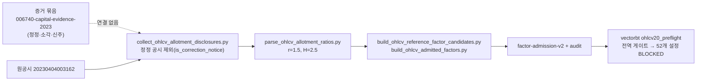

# 006740 공급자 입력 revision 연결안

**결론: 연결은 가능하지만, 연결해도 006740 거래량 승인과 OHLCV20 실행 차단은 풀리지 않는다.** 정정 공시로 바뀌는 것은 배정 대상 주식수의 근거뿐이고 비율 r=1.5는 같다. 따라서 H=2.5와 가격 역산값 약 2.3247의 차이 7.54%가 그대로 남고, 0.5% 기준을 넘는다. 이 문서는 [006740 증거 인계](006740-evidence-handoff-2026-09-23.md)의 다음 단계를 설계하되, 최소 범위로 줄이는 권고를 함께 적는다.

## 1. 현재 연결 상태

증거 묶음은 수집 manifest 바깥에 있으므로, 어떤 생성 단계도 그 해시를 읽지 않는다. 연결의 핵심은 수집 단계가 정정 체인을 기록하도록 바꾸는 것이다.

## 2. 연결 설계

| 단계 | 저장소 · 파일 | 변경 내용 | 완료 기준 |
| --- | --- | --- | --- |
| R1 | ted-startup `collect_ohlcv_allotment_disclosures.py` | 정정 공시를 버리지 않고 원공시와 묶어 `correction_chain` 으로 기록한다. 선택 규칙은 「신호일 이전에 접수된 마지막 정정본」 이다 | 006740 행의 선택 공시가 `20230406002900`, 원공시가 `20230404003162` 로 기록된다 |
| R2 | 같은 manifest | 행마다 `selected_rcept_no` · `original_rcept_no` · `source_sha256` · `rcept_dt` 를 둔다 | 증거 묶음 manifest 의 원문 해시와 일치한다 |
| R3 | 같은 manifest | 근거를 `known_at`(4월 공시 3건)과 `post_hoc`(7/12 정정 분기보고)으로 나눈다 | `post_hoc` 근거가 계수·신호 계산에 쓰이지 않음을 테스트로 확인한다 |
| R4 | `parse_ohlcv_allotment_ratios.py` 이후 | 선택 공시로 재파싱하고 새 revision(v3) 계수·audit 를 만든다. v2 는 봉인 그대로 둔다 | 006740 의 r=1.5 · 배정 대상 17,667,324 가 기록되고 차단 코드는 그대로 남는다 |
| R5 | vectorbt `ohlcv20_input.py` · `ohlcv20_preflight.py` | 소비 입력 경로와 봉인 해시를 v3 로 바꾼다 | 기존 테스트가 v3 fixture 로 통과한다 |

표가 말하는 것: R1~R3 은 출처 기록의 정확성을 높이고, R4~R5 는 새 revision 을 소비하게 만든다. 어느 단계도 계수 승인 판정을 바꾸지 않는다.

### 정하지 않고 남긴 것

- **분모 정책**: 무상증자 H 를 「적격주주 배정비율」 로 볼지 「총발행주식 기준 실효계수」 로 볼지는 104키 전체의 정책 문제다. 006740 하나로 정할 일이 아니다.
- **외부 참조 경로**: 검증기 `verify_bundle.py` 는 로컬 절대 경로 6개를 참조한다. R2 에서 저장소 상대 경로로 바꾸는 편이 낫지만, 봉인 해시가 바뀌므로 새 revision 에서만 한다.

## 3. 권고: R1~R3 만 하고 R4~R5 는 미룬다

| 선택지 | 하는 일 | 백테스트에 미치는 영향 |
| --- | --- | --- |
| A. R1~R3 만 (권장) | 수집 manifest 가 정정 체인을 기록하도록 고친다. 104키에도 같은 규칙이 적용된다 | 없음. 다만 재수집 때 같은 누락이 반복되지 않는다 |
| B. R1~R5 전부 | 새 계수 revision 을 만들고 vectorbt 까지 연결한다 | 없음. 006740 은 계속 차단되고, 봉인 · 해시 · 테스트 갱신 비용만 든다 |
| C. 보류 | 증거 묶음만 보존한다 | 없음 |

006740 은 104키 중 1키이며, 104키의 신호 준비 의존은 약 2,383종목·일로 평가 구간 신호 자격 731,719행의 약 0.3% 다.

## 4. 정정 — OHLCV20 을 막는 것은 계수가 아니라 체결 승인이다 (같은 날 추가)

§3 의 초판은 「fold 전체 BLOCKED」 사전등록 규칙이 실행을 막는다고 적었으나 틀렸다. 그 규칙은 [거래량 전략 사전등록](volume-strategy-preregistration-2026-09-21.md)의 `krx-breakout-rvol-v2` 실험 규칙이며, OHLCV20 과는 다른 실험이다. 계수는 이미 바 단위 부분 승인으로 소비되고 있다(`signal_admitted=true`).

2026-09-23 에 `ohlcv20_preflight` 를 다시 실행한 결과, 차단 코드는 `CORRECTED_INPUT_NOT_EXECUTION_ADMITTED` · `REAL_EXECUTION_NOT_ADMITTED` · `RIGHTS_CONTRACT_NOT_EXECUTION_ADMITTED` 세 개뿐이다. 셋 다 체결 축(보유 중 유상증자 권리락 · 기업행사 · 일별 상장/매도 상태)의 승인이며, 해소 경로는 ted-startup `docs/research/execution-admission-design-2026-09-23.md` 가 설계하고 있다. 006740 연결안은 이 차단에 영향이 없다.
