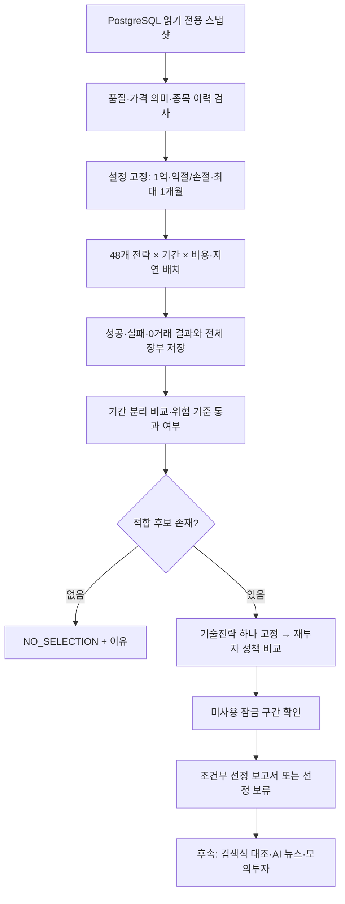

# 1억 원·최대 1개월 보유 전략 연구 프로그램: 설계 패키지

**목적:** PostgreSQL에 수집한 약 10년의 국내주식 OHLCV로 여러 매수·매도 기법을 일괄 실행하고, 모든 결과를 저장·비교해 사용자 조건에 맞는 **최종 기술전략 한 개**를 선정할 프로그램을 정의한다. PRD·요구사항·전략/기술 명세·WBS를 기준으로 연구 엔진과 일괄 실행 CLI를 구현했다. 실제 자료는 품질 인수에서 차단되어 수익률 산출·전략 선정은 보류했다. **최신 상태와 실행 명령은 [구현·실행 결과](implementation-and-results-2026-09-13.md)를 먼저 읽는다.**

**확정한 사용자 조건:** 초기 투자금 1억 원, 외부 여유자금 1~2억 원은 투자 계좌와 분리, 추가 입금·인출 없이 이익 재투자, 종목당 최대 1개월 보유, 매수 전에 익절·손절 가격 지정이다. 기존 최대 약 20종목을 기본 상한으로 유지하되 수익 발생 시 **종목 수 확대와 종목당 매수금액 확대를 별도 정책으로 비교**한다. 이전의 2~5거래일 위주 해석은 폐기한다.

**권장안:** 12개 진입 정의 × 4개 익절·손절 정의 = **48개 전략 후보**를 같은 공동 계좌 조건에서 비교한다. 전체 기간 최고수익이 아니라 기간을 나눈 검증과 비용·체결 스트레스 기준으로 한 후보를 고정한다. 적합 후보가 없으면 `NO_SELECTION`으로 끝내고 이유를 보존한다. 현재 가격 조정·0원 봉·역사 종목 이력의 인수 문제는 코드 제작과 별개로 해결해야 한다.

## 읽는 순서와 문서의 역할

먼저 아래 PRD로 만들 프로그램의 목적을 이해하고, 요구사항으로 완료 기준을 확인한다. 전략 명세는 무엇을 계산할지, 기술 명세는 어떻게 실행·저장·선정할지, WBS는 어떤 순서로 구현하고 검증할지 정한다.

| 문서 | 답하는 질문 |
| --- | --- |
| [PRD](prd.md) | 사용자가 어떤 문제를 해결하고 어떤 결과물을 받는가 |
| [요구사항 정의](requirements.md) | 데이터·자본·매매·일괄실행·저장·선정의 필수 동작과 인수 기준은 무엇인가 |
| [백테스트 전략 명세](strategy-spec.md) | 48개 후보의 진입·익절·손절·기한·계좌 규칙을 어떻게 계산하는가 |
| [기술 명세](technical-spec.md) | 모듈, 실행 상태, 저장 형식, 배치 수, 검증 구간과 단일 선정 절차는 무엇인가 |
| [WBS](wbs.md) | 구현 작업·의존성·산출물·검증 기준과 미확정 결정을 어떤 순서로 해결하는가 |

용어: PRD는 제품 요구 문서, spec은 구현할 동작의 명세, WBS는 작업 분해표다. 이 문서 세트가 새 프로그램의 기준이며 기존 [단일종목 예제](../research_backtest.py)는 사용법·기초 검사 참고 자료다. 새 프로그램의 1개월·익절/손절·공동계좌 기능이 기존 예제에 있다고 보지 않는다.

## 전체 동작

사용자는 수십 개 콘솔 명령을 관리하는 대신 설정 파일 한 개와 한 번의 배치 요청으로 진행 상태와 결과를 받게 된다. 잠금 구간을 열기 전에는 선택 결과를 고정하는 별도 단계가 있다.

기술전략 연구가 먼저다. AI 뉴스·증권사 조건검색·주문 자동화는 선정된 기술 기준선을 바꾸는 후속 실험이며 이번 배치의 성과 입력에 섞지 않는다. 최종 후보의 검색식 이식 가능 여부는 별도 태그로 기록한다.

## 보유기간·자본·가격에 대한 핵심 결정

| 항목 | 새 기준 |
| --- | --- |
| 최대 1개월 | **달력 1개월**을 기본 해석으로 제안. 진입일의 다음 달 같은 날짜, 없는 날짜는 그 달 말일. 비거래일이면 그 이전 마지막 공식 거래일 시가에 기한 청산 시도 |
| 정지 등으로 기한 청산 불가 | 가상 체결하지 않고 초과 보유 사유·평가 지연·재시도를 기록. 정상 규칙 위반과 불가피한 체결 예외를 구분 |
| 익절·손절 | 신호일의 알려진 가격·변동성으로 **매수 계획의 원화 TP·SL 가격을 먼저 고정**. 실제 진입가가 범위를 벗어나면 매수 거절 |
| 재투자 | 직전 거래일의 실제 계좌 평가액과 당일 사용 가능한 현금으로 신규 수량 계산. 손실이 나면 규모도 줄어듦 |
| 여유자금 | 1~2억 원의 외부 자금은 수익률 분모·주문 예산·손실 복구 입금에서 제외 |
| 종목 수 | 기본 최대 20개. 보유·미체결 매수·예약 종목의 합집합으로 관리. 20개 초과 확대는 이번 비교 범위 밖 |
| 위험 한도 | 사용자의 최대 허용손실은 아직 미정. 연구용 낙폭 상한 20% 등은 제안이며 실전 허용손실의 확정값이 아님 |

1개월을 20/21거래일과 동의어로 구현하지 않는다. 1월 31일→2월 말일처럼 월 경계를 검사하고, 공식 거래일이 없으면 날짜를 추정하지 않는다. 정확한 체결 순서는 [전략 명세](strategy-spec.md)에 둔다.

## 1억 원의 복리 목표를 어떻게 해석할 것인가

이전의 월 1,000만 원은 장기적인 성과 목표로 보존한다. 초기 1억 원에서 월 1,000만 원은 **월 10%**에 해당하며 달성 가능성은 아직 검증되지 않았다. 이를 모든 후보의 의무 목표나 거래 횟수를 늘리는 조건으로 쓰지 않는다. 인출 없이 수익을 재투자하므로 월별 계좌 금액에 따라 원화 손익도 달라진다.

아래는 비용 차감 계좌 수익률이 매달 같다는 **설명용 가정**이다. 외부 입출금 0, 초기 1억 원, `C_m = 1억 × (1+r)^m`로 계산했다. 실제 수익은 변동하고 손실월도 포함된다.

| 가정 월수익률 | 12개월 후 평가액 | 36개월 후 평가액 |
| --- | ---: | ---: |
| 0.5% | 약 1억 617만 원 | 약 1억 1,967만 원 |
| 1% | 약 1억 1,268만 원 | 약 1억 4,308만 원 |
| 2% | 약 1억 2,682만 원 | 약 2억 399만 원 |

고정 수익률을 기대한다는 뜻이 아니라 **재투자·기간·수익률의 관계**를 보여준다. [Investor.gov 복리 계산기](https://www.investor.gov/financial-tools-calculators/calculators/compound-interest-calculator)도 초기금액·입금·기간·이율을 별도 입력으로 구분한다. 실제 프로그램은 일정 r로 미래를 생성하지 않고 과거 주문·체결·현금 장부의 결과로 자산을 계산한다.

성장 정책은 고정 20종목 범위에서 매수금액을 키우는 정책과, 초기 10종목에서 계좌 성장에 따라 15→20종목까지 늘리는 연구안을 비교한다. 이때 투자 비중과 현금 비중이 달라질 수 있으므로 단순 수익률만으로 정책을 평가하지 않는다. 자세한 단계·조건은 기술 명세에서 고정한다.

## 지금 무엇이 완료됐고 무엇이 남았는가

설계와 연구 핵심 엔진·실행/저장/검증 경로를 구현했다. 실제 데이터 인수, 기업행사·현실 비용 어댑터, 후속 잠금 평가와 최종 전략 선정은 남아 있다. [갱신한 WBS](wbs.md)와 [실행 결과](implementation-and-results-2026-09-13.md)를 따른다. 아래 14:12 실측은 설계 당시 기록이다. 2026-09-13 14:12 KST의 저장된 DB 실측은 조정가격 8,789,127행·5,011종목, 2015-01-02~2026-09-10이며 종가 0인 1,201행이 있었다. 후속 구현 작업에서 15:34에 DB를 다시 확인하고 2015~2023년을 추출했다. [이전 실측](../evidence/db-current-status-2026-09-13.json)

구현자는 먼저 WBS의 계약·스냅샷·작은 회귀 사례부터 진행하면 된다. 데이터 인수가 미완료여도 소프트웨어·합성 데이터·상태 처리 구현은 가능하다. 다만 완전한 인수 전 결과는 탐색용으로 표시하고 “1억 원 운용에 적합한 전략 선정 완료”로 승격하지 않는다.

설계 검증: 문서 상대 링크·48개 후보 ID·849개 계획 슬롯·월말/윤년 계산·복리 예시를 검산했다. 기존 실행 코드는 변경하지 않았다. [설계 검증 기록](design-validation.json), [개발용 설정 예시](experiment-config.example.json)를 함께 제공하며 둘 다 실제 전략 성과가 아니다.
