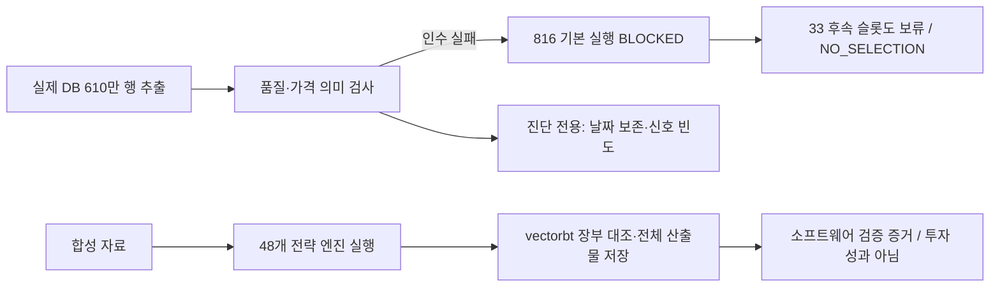

# 구현·실제 데이터 실행 결과: 연구 엔진 준비, 전략 선정 보류

**사용자 확정 결정(2026-09-13):** “데이터 검증을 통과한 뒤 정식 비교·선정”한다. 미검증 조정가격의 탐색용 수익률 실행도 진행하지 않는다. 검증 전에는 읽기 전용 원천·품질 조사, 수익률을 계산하지 않는 진단, 합성 자료의 프로그램 검증을 진행한다. 이 결정 자체가 데이터 검증 통과를 뜻하지 않는다.

**최종 검증 구간 사용 이력:** 사용자가 2024년~2026년 9월 자료를 과거 전략 선택·튜닝에 사용하지 않았다고 확인했다. 현재 제안 구간 `2024-01-01~2026-09-10`을 미사용 최종 검증 구간으로 유지한다. 확인 근거는 사용자 진술이며 독립 감사 결과는 아니다. 데이터 인수와 후보·자금배분 정책 고정 전에는 계속 잠근다. [사용자 결정 기록](user-decisions-2026-09-13.json)은 다음 실험 설정에 반영할 입력이며, 해시가 고정된 기존 실험 설정은 소급 변경하지 않는다.

**결론:** `research.krx_lab` 연구 프로그램을 구현하고 홈서버 PostgreSQL의 실제 자료로 실행 절차를 진행했다. 다만 실제 수익률 비교는 데이터 인수 단계에서 `BLOCKED`, 최종 판단은 **`NO_SELECTION`**이다. 이 결과는 “48개 전략의 수익성이 나빴다”는 의미가 아니라 **수익률을 신뢰할 입력 조건이 아직 갖춰지지 않았다**는 의미다. 합성 자료의 장부 검산과 실제 시장 성과를 구분한다.

사용자 조건인 초기 1억 원·외부 입출금 0·최대 달력 1개월·진입 전 TP/SL·최대 20종목을 체결 엔진에 반영했다. 전체 제품의 완료를 선언하는 단계는 아니다. 원가격/기업행사·역사 종목/거래 상태·현실 비용 인수와 후속 잠금 평가 구현은 남아 있다. DB 접속 장애 때문에 멈춘 것은 아니다.

먼저 아래 실측과 완료 범위를 읽고, 저장된 결과를 열어 본다. 재실행 명령은 뒤에 있으며 [WBS](wbs.md)는 설계 목표 중 어디까지 구현·검증했는지를 구분한다.

## 1. 실제 DB에서 확인한 결과

2026-09-13 15:34 KST에 `ssh home`으로 연결해 `kiwoom-db` PostgreSQL을 읽기 전용으로 조회했다. 전체 DB 범위와 이번 실험 입력 범위를 혼동하지 않는다. **최종 잠금 제안 구간인 2024년 이후 가격은 이번 스냅샷에서 제외했다.**

| 구분 | 전체 DB 재확인 | 이번 개발·검증용 추출 |
| --- | ---: | ---: |
| 요청 범위 | 2015-01-02~2026-09-10 관측 | 2015-01-02~2023-12-31 요청, 실제 마지막 봉 2023-12-28 |
| 행 수 | 8,789,127 | 6,109,214 |
| 종목 코드 수 | 5,011 | 4,025 |
| 비양수 OHLC | 89,239 | 아래 종합 OHLCV 검사에 포함 |
| 비정상 OHLCV | 이번 전체 재조회에서는 종합 집계하지 않음 | 72,072행·453종목 |
| 거래량 0 | 332,193 | 211,623 |
| 키 중복 | 이번 전체 재조회에서는 검사하지 않음 | 0 |
| 공급자 라벨 | KIWOOM 8,176,520 / KRX 612,607 | KIWOOM 5,564,973 / KRX 544,241 |

비정상 OHLCV는 비양수 가격·결측/무한 수치·음수 거래량·OHLC 가격 관계 위반을 합친 행 단위 검사다. 거래량 0은 별도 진단이며 이 숫자들을 더해 “전체 오류 수”로 만들지 않는다. 공급자 라벨은 저장된 값이며 모든 행의 원천 계보를 독립적으로 입증하는 것은 아니다.

세 가지 직접 차단 사유는 다음과 같다.

1. **`INVALID_OHLCV`**: 비정상 가격 봉을 정상 체결 가격으로 사용할 수 없다. 특히 거래정지인지, 조정 정밀도 문제인지 원인이 구분돼야 한다.
2. **`PRICE_SEMANTICS_UNVERIFIED`**: `adjusted=true` 가격을 실제 당시 원화 가격·정수주 수량과 연결하는 계약이 없다.
3. **`MIXED_VENDOR_ADJUSTMENT_UNVERIFIED`**: KRX와 키움의 조정 기준이 같은지 확인되지 않았다. 현재 키움 일봉 원천 응답 보관 건수는 0건이다.

상장폐지 시세가 추가된 것은 확인했다. 하지만 그것만으로 당시 투자 가능한 보통주·거래정지·상폐 정산·조정 방식까지 인수됐다고 보지 않는다. 마스터의 현재 시장 코드나 현재 활성 여부로 과거 종목을 임의 제거하지 않았다.

## 2. 지금 사용할 수 있는 기능과 남은 기능

| 영역 | 구현·검증한 내용 | 남은 한계 |
| --- | --- | --- |
| 진입 | 이평 교차·신고가·추세 눌림·RSI 재진입·볼린저 복귀·MACD의 12개 정의 | 증권사 HTS 조건검색 결과의 일치 검증은 별도 |
| 청산 | 4개 TP/SL 조합, 월말 clamp, 달력 기준 만기, 갭·동봉 손절 우선 | 역사 호가단위·기업행사·실제 거래 가능 상태 인수 |
| 계좌 | 1억 공동 현금, 정수주, 전일 평가액 재투자, 20개 상한, 업종·거래 위험·거래량 한도 | 실제 원가격의 기업행사 정수주 정산 |
| 성장 정책 | `fixed20`, `staged10_15_20` 시뮬레이터 | 실제 적격 후보를 대상으로 한 두 정책 비교 배치 |
| vectorbt | 체결 순서별 다종목 공동 현금 재생, 수량·가격·수수료·일말 자산 대조 | 체결의 시장 현실성을 독립적으로 보장하는 것은 아님 |
| 저장 | SQLite run/attempt, Parquet 장부, JSON 해시, 오류 추적·중단 재개, 중복 worker 차단 | 다중 호스트 worker·자원 강제 할당은 미지원 |
| 보고 | 전체 실행 상태·차단 이유, 리더보드 CSV, 월별 통계, HTML/Markdown | 상세 NAV·낙폭 대시보드는 후속 |
| 선정 | 16슬롯 완전성·비용/지연·거래 수·낙폭·집중도·고정 순위 | 정식 데이터 인수, 현실 비용·후속 단계·freeze/finalize |

현재 **수익률 배치는 합성 자료에서 실행 가능**하다. 실제 조정 자료는 품질 검사·신호 빈도 진단까지 지원하며, 실제 자료의 성과 실행은 차단한다. `EXPLORATORY_ADJUSTED` 등급만 선언하거나 설정 값을 바꾸어 `EXECUTION_ELIGIBLE`로 승격시키는 우회 경로는 없다.



## 3. 결과는 어디에 저장됐는가

대량 원본과 거래 장부는 Git에 넣지 않고 `%LOCALAPPDATA%\vectorbt-research\`에 저장했다. 아래 디렉터리 안의 `report.html`을 브라우저로 열면 된다. 이동·삭제하면 해당 로컬 링크와 재개 경로도 함께 갱신해야 한다.

| 디렉터리 | 내용 |
| --- | --- |
| `krx-lab-db-20260913-1542` | 실제 610만 행 Parquet 청크, 추출 SQL, manifest, 품질 검사 |
| `krx-lab-real-20260913-final` | 실제 자료 849슬롯 상태·attempt, 선정 보류·전체 비교 보고서 |
| `krx-lab-synthetic-data-20260913` | 난수 seed 고정 8종목 합성 자료 |
| `krx-lab-synthetic-20260913-final` | 합성 전략 배치·체결/포지션/월별 장부와 vectorbt 검산 |
| `krx-lab-diagnostic-20260913-v2` | 실제 자료의 종목·연도별 신호 빈도 434,700행, 12개 조건 합계 |

실제 자료 실행은 기본 816개가 데이터 사유로 차단됐고, 후속 33개는 선행 적격 후보·정식 기준상품·비용 프로필 등의 조건을 충족하지 못해 보류됐다. **849개의 수익률을 계산했다는 뜻이 아니다.** 각 전략의 빈 거래 수나 빈 성과는 측정된 0% 수익으로 해석하지 않는다. 합성 48개 개발 전략과 한 전략의 검증 16조합을 실행해 64건을 검산했다. 합성 전체 검증 768개를 모두 실행했다는 뜻은 아니다. 정확한 검증 수와 최종 실행 상태는 [기계 판독 검증 기록](implementation-validation-2026-09-13.json)에 보관한다.

첫 스냅샷 시도는 데이터 전송 뒤 빈 DataFrame의 품질 집계 코드에서 실패했다. 실패 manifest를 보존하고 해당 경계 처리를 수정한 뒤 새 디렉터리로 전체 추출을 성공시켰다. 실패 시도를 성공 스냅샷으로 덮어쓰지 않았다.

### 실제 자료에서 계산한 것은 조건 발생 빈도다

관측 거래일 2,214개를 보존하고, 비정상 OHLCV는 **진단용 메모리 사본에서만 결측 처리**해 지표 준비 구간을 끊었다. 원본·날짜·상폐 종목을 삭제하지 않았다. 아래는 2015~2023년의 신호 수이며 실제 매수 체결 수·수익률이 아니다. 같은 종목에서 반복되는 신호도 포함한다. 공급자 조정 의미와 당시 거래 가능성은 여전히 미확정이다.

| 전략군 | 첫 번째 진입 조건 / 신호 수 | 두 번째 진입 조건 / 신호 수 |
| --- | --- | --- |
| 이평 교차 | 5/20일: 61,191 | 10/20일: 53,740 |
| 이전 최고 종가 돌파 | 이전 20일: 233,079 | 이전 60일: 132,164 |
| 추세 내 눌림 | 3일 -3%: 193,765 | 3일 -5%: 108,285 |
| RSI 재진입 | 30선: 128 | 40선: 5,400 |
| 볼린저 복귀 | 1.5 표준편차: 17,278 | 2 표준편차: 6,871 |
| MACD 교차 | 60일 이평 필터: 39,074 | 120일 이평 필터: 39,439 |

**해석:** RSI 30 재진입은 현재 정의에서 매우 드물어 충분한 완료 거래 수를 확보하기 어려울 가능성이 있다. 다만 이 빈도만으로 어느 전략이 더 수익성이 좋은지는 판단할 수 없다. HTML의 비용별 평균 그래프도 완료된 실행의 단순 집계이며 구간·후보 구성이 같을 때만 비용 효과 비교에 사용한다.

## 4. 사용자가 실행할 명령

저장소 루트 PowerShell에서 실행한다. 기존 `.venv`를 사용하고 `-X utf8`로 한글 출력 인코딩을 명시한다. 기존 10봉 단일종목 예제와는 다른 프로그램이다.

```powershell
# 최초 1회: 기존 vectorbt 개발 환경에 연구 저장 의존성만 추가
uv pip install --python .venv -r research/krx_lab/requirements.txt

$labRoot = Join-Path $env:LOCALAPPDATA 'vectorbt-research'
$realExperiment = Join-Path $labRoot 'krx-lab-real-20260913-final'
$syntheticExperiment = Join-Path $labRoot 'krx-lab-synthetic-20260913-final'

# 이번 실측 결과 확인
.venv/Scripts/python.exe -X utf8 -m research.krx_lab status --experiment $realExperiment
.venv/Scripts/python.exe -X utf8 -m research.krx_lab report --experiment $realExperiment
.venv/Scripts/python.exe -X utf8 -m research.krx_lab select --experiment $realExperiment

# 합성 실험에서 아직 안 한 검증 구간을 소량 실행/재개
.venv/Scripts/python.exe -X utf8 -m research.krx_lab resume --experiment $syntheticExperiment --phase validation --limit 16
.venv/Scripts/python.exe -X utf8 -m research.krx_lab report --experiment $syntheticExperiment
```

`--limit`는 운영 검사용 실행 건수다. 나머지는 `PLANNED`로 남으며 전체 검증을 완료했다고 표시하지 않는다. 코드·설정·데이터·주요 의존성 버전이 바뀌면 기존 실험을 재개하지 않고 **새 실험**을 만들어야 한다.

새 추출부터 만드는 절차는 다음과 같다. 이름에 시각을 붙여 기존 결과를 보존한다. 현재 데이터 계약 그대로라면 새 실험도 수익률 단계에서 차단되는 것이 정상이다.

```powershell
$stamp = Get-Date -Format 'yyyyMMdd-HHmmss'
$snapshotPath = Join-Path $labRoot "snapshot-$stamp"
$configPath = Join-Path $labRoot "config-$stamp.json"
$experimentPath = Join-Path $labRoot "experiment-$stamp"

.venv/Scripts/python.exe -X utf8 -m research.krx_lab snapshot --out $snapshotPath
.venv/Scripts/python.exe -X utf8 -m research.krx_lab config --snapshot $snapshotPath --out $configPath
.venv/Scripts/python.exe -X utf8 -m research.krx_lab plan --config $configPath --out $experimentPath
.venv/Scripts/python.exe -X utf8 -m research.krx_lab run --experiment $experimentPath --phase development,validation
.venv/Scripts/python.exe -X utf8 -m research.krx_lab report --experiment $experimentPath

# 수익률 없이 실제 자료의 조건 발생 빈도만 조사
$diagnosticPath = Join-Path $labRoot "diagnostic-$stamp"
.venv/Scripts/python.exe -X utf8 -m research.krx_lab diagnose --snapshot $snapshotPath --out $diagnosticPath

# 의미 있는 회귀 검사
.venv/Scripts/python.exe -X utf8 -m pytest tests/research docs/strategy-research/test_research_backtest.py -q
```

`freeze`, `finalize`, `run --phase holdout`은 아직 활성화하지 않았다. 미사용 구간 확인과 정식 데이터·현실 비용 인수 없이 잠금 성과를 열 수 없다. 설계 예시 `experiment-config.example.json`은 실행 설정과 구별되며, 실제 설정은 `config` 명령으로 만든다.

## 5. 실제 전략 한 개를 선정하려면 필요한 다음 입력

가장 먼저 백필 담당 프로젝트에서 **가격 계약과 오류 원인**을 받아야 한다. “DB 연결 성공”이나 `adjusted=true` 플래그만으로 이 단계가 해결되지 않는다.

1. 키움·KRX별 조정 대상, 기준일, 가격/거래량 단위, 반올림, 소급 정정 규칙과 비교 가능한 원천 표본.
2. 0원·비정상 봉의 원인 및 거래정지/정상 비거래/상폐 등 상태 구분. 원본을 삭제하지 않는 분석 처리 계약.
3. 실제 원가격과 기업행사 가격·수량 계수, 상폐/합병 등의 보유 주식 정산 자료.
4. 공식 거래일과 당시 종목 유형·시장·업종·거래 가능 이력, 날짜별 현실 비용 입력.
5. 2024년 이후 자료의 과거 전략 선택·튜닝 미사용은 사용자 확인 완료. 후보·정책 고정과 데이터 인수 후 새 실험에 확인 사실을 반영하고 잠금 평가를 진행한다.

이를 받아 데이터 인수·기업행사/현실 비용 어댑터와 후속 단계를 완성한 뒤, 같은 48개 후보를 실제 공동 계좌로 비교한다. 선정 기준을 사후에 낮추거나 제외 종목을 수익률을 보고 고르지 않는다. 월 1,000만 원 달성 여부와 실제 적정 투자금에 대한 새 결론은 이번 차단 결과만으로 만들 수 없다.

## 6. 검증의 범위

소프트웨어 검사는 월말·윤년·기한 초과, 갭 손절, 동봉 TP/SL, 시가 판단의 미래 정보 차단, 공동 현금, 재투자, 후보 순서, 지표 초기화·결측·미래 봉 불변성, 선정 게이트, 실행 이력·손상 파일·0거래·장부 불일치를 포함한다. 합성 성공 run은 vectorbt의 `engine='numba'`, `cash_sharing=True` 주문 재생과 대조했다.

전체 vectorbt 제품 API·Rust 엔진을 바꾸지 않았으므로 저장소 전체 pytest·Rust 빌드·MkDocs 배포 빌드는 실행하지 않았다. 실제 증권사 주문, 뉴스 AI 호출, 다른 저장소/DB 수정, 커밋·푸시는 수행하지 않았다. 기존 단일종목 예제와 프롬프트 원본은 보존했다.
