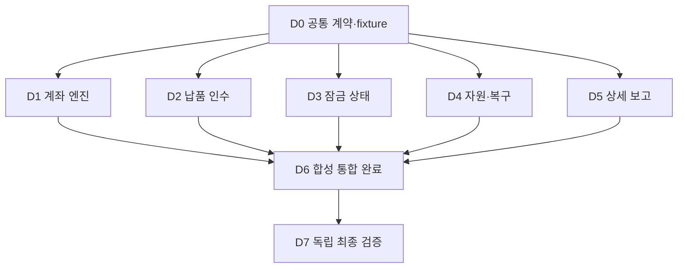

# 데이터 보완 대기 중 병렬 개발: 작업 분담과 의존성

이 문서는 ted-startup의 데이터 보완과 동시에 vectorbt에서 진행할 소프트웨어 작업의 담당·의존성·검증 기준을 정한다. **공통 계약을 먼저 고정한 뒤 엔진·인수 검사·잠금 상태 관리를 병렬 개발하고, 빈 슬롯에 복구·보고 작업을 배정한다.** 2026-09-14 사용자가 추천안 1번을 선택하여 D0~D7 로컬 구현·검증에 착수했다. 합성 검증 완료, 실제 데이터 인수, 실제 전략 선정은 각각 별도 상태다.

범위는 기존 [주 WBS](wbs.md)의 W02~W03, W05~W11에 남은 소프트웨어 작업이다. 수집·적재·원천 보존·데이터 정정은 ted-startup 담당이다. 이 계획은 ted-startup에 새로운 DB 스키마나 수집 작업을 지시하지 않는다. 기존 [재납품 명세](remediation-discovery-2026-09-14/delivery-spec.md)를 소비하는 쪽의 계약을 구체화한다. 실제 수익률 실행과 2024년 이후 잠금 가격 열람은 포함하지 않는다.

**계획 작성 진행률: 100% · 완료 3/3 · 남은 작업: 없음 · 차단: 없음.**
**후속 개발 진행률: 100% · 완료 8/8 · 남은 작업: 이번 D0~D7 범위 없음 · 외부 의존: 실제 데이터 인수는 ted-startup 납품 대기.** 합성 소프트웨어와 전체 연구 완료를 구분한다.

먼저 작업 표에서 산출물과 완료 기준을 확인하고, 계약·의존성 절에서 언제 시작할 수 있는지 읽는다. 파일 소유권과 배정 순서는 동시 수정 충돌을 방지한다. 마지막 검증 절은 소프트웨어 완료를 판정하는 방법이다.

## 1. 계획 작성과 후속 개발의 완료율을 분리한다

계획 작성은 아래 세 항목으로 관리한다. 작성 완료가 개발 완료율을 올리지는 않는다.

| ID | 산출물 | 담당 | 선행 | 완료 기준 | 가중치 | 상태 |
| --- | --- | --- | --- | --- | --- | --- |
| P1 | 기존 WBS·코드·재납품 계약 대조 | 메인 + 탐색 에이전트 | 없음 | 누락 기능·공유 파일·기존 테스트 확인 | 30 | 완료 |
| P2 | 분담·의존성·검증 계획 | 메인 | P1 | D0~D7, 파일 소유권, 모델, 검토 방식 명시 | 40 | 완료 |
| P3 | 독립 검토와 정합성 확인 | 별도 검토자 + 메인 | P2 | 지적 수정, 링크·diff·진행률 확인 | 30 | 완료 |

후속 개발 가중치는 예상 작업량 기준으로 정했으며 합계 100이다. 각 항목은 구현·관련 검사·작성자와 다른 에이전트의 검토·지적 수정을 모두 마쳐야 완료다. 부분 구현은 진행 또는 검증 중으로 남긴다. 범위를 바꾸면 이유와 가중치를 함께 갱신한다.

| ID / 주 WBS | 작업·산출물 | 담당 역할 / 예정 모델·추론 | 착수 선행 | 완료 기준 | 가중치 | 상태 |
| --- | --- | --- | --- | --- | --- | --- |
| D0 / W01~03 | 입력·장부·상태·실행 훅 계약 v1, 공통 합성 fixture | 메인 / 현재 설정; 계약 검토 Astra high | 없음 | 아래 C1~C4의 필드·실패·버전 계약과 소비자 대조 완료 | 10 | 완료 |
| D1 / W05~07 | 원가격·기업행사·역사 시장 입력을 처리하는 합성 계좌 엔진 | 엔진 담당 / gpt-6-astra high | D0 | 분할·병합·배당·정지·상폐와 비용·호가 변경에서 독립 장부 일치; 미지원 사건 명시적 차단 | 25 | 완료 |
| D2 / W02~03 | 납품 인수 어댑터·계보·역사 정합성 검사 | 인수 담당 / gpt-5.6-terra medium | D0 | 정상·누락·불일치 입력과 새 revision 검사; 합성 자료의 실제 인수 등급 승격 금지 | 15 | 완료 |
| D3 / W11 | 후보·정책 고정 및 freeze/finalize 상태 모듈 | 잠금 담당 / gpt-6-astra high | D0 | 합성 증거로 고정·변조 거절·NO_SELECTION·재실행 기록 검증; 미충족 선행 검사 | 15 | 완료 |
| D4 / W08~09 | 자원 감시·안전 중단·저장/재개 보강 | 운영 담당 / gpt-5.6-terra high | D0 | C4 fixture로 한도 감지·중단 전파·registry 재개 검증; 실제 runner 장애 검증은 D6 | 12 | 완료 |
| D5 / W10 | 상세 자산·낙폭·월별 손익·거래 추적 보고 | 보고 담당 / gpt-5.6-terra medium | D0 | 공통 합성 장부의 현금·노출·미청산·비용 표시 및 거래→manifest 추적 대조 | 8 | 완료 |
| D6 / W07~11 | 공통 CLI·runner 연결과 합성 통합 시나리오 | 메인 / 현재 설정 | D1~D5 | 각 기능 연결·실제 runner 중단/rename/registry 경계·재개 검증; 해시·차단 유지 | 10 | 완료 |
| D7 / W07~11 | 독립 전체 검토·수정 재검증·소프트웨어 인수 기록 | 별도 검토자 / gpt-6-astra high + 메인 | D6 | 관련 전체 회귀와 독립 장부·잠금·복구 검토 통과, 잔여 제한 기록 | 5 | 완료 |

모델은 현재 실행 도구에서 선택 가능한 식별자에 근거한 예정 배정이다. 실제 착수 때 에이전트 ID·명시한 model/reasoning_effort·수정 파일·검증 명령·검토자를 작업 기록에 남긴다. 다른 모델을 지정할 때 전체 대화 상속 대신 제한된 문맥과 작업 요약을 전달한다. 선택 실패 시 조용히 대체하지 않고 실제 배정을 기록한다. 개발 담당과 검토자는 다른 에이전트로 배정하되 같은 모델 사용은 가능하다.

## 2. 먼저 고정할 것은 완성된 기능이 아니라 연결 계약이다

D0는 전체 설계를 다시 하는 작업이 아니다. 아래 최소 계약을 기존 명세에 맞춰 확정하고 경계 사례 fixture를 제공한다. 계약 모듈 `research/krx_lab/contracts.py`와 전용 fixture를 구현했다. 상세 필드는 [계약 v1](contracts-v1.md)을 따른다.

| 계약 | 생산자 → 소비자 | 고정할 내용 | D0 확인 기준 |
| --- | --- | --- | --- |
| C1 납품 입력 | D2 → D1·D6 | 영구 종목 ID, 코드 유효기간, 원가격/조정계수, 기업행사, 거래 상태/달력, 비용·호가 프로필, 출처·시점·revision | 재납품 명세와 대응표; 필수/조건부 필드·단위·시간 정밀도·미지원 사유 구분 |
| C2 계좌 장부 | D1 → D5·D6·독립 검토 | 주문/체결/사건 ID, 현금·보유수량·미수/정산 대기·평가액, 수수료/세금, 미해결 문제, 파일 manifest | 독립적으로 계산 가능한 소형 예제와 보존식; 배당 인식/지급 및 단주 처리 구분 |
| C3 선정 상태 | D3 → D5·D6 | 후보·성장정책·비용·선정규칙·코드/데이터 해시, 잠금 접근 기록, 재실행/실패 상태 | 상태 전이표와 금지 전이; 합성 시험과 실제 후보 기록의 분리 |
| C4 실행/저장 | D4 → D3·D6 | 시작·자원 초과·중단·부분 저장·확정·재개 훅, 오류코드, artifact 검증 | runner/registry 기존 계약과 호환; OS별 지원 범위와 한도 보장 수준 정의 |

사건 순서·가격/수량 계수·단주·배당·정산 시점의 미확정 사항은 임의의 실제 시장 사실로 채우지 않는다. 합성 시나리오의 명시적 정책으로 검증하고 실제 적용에는 근거 있는 프로필을 요구한다. 신호에 쓰는 가격과 실제 체결·수량 계산의 가격을 구분한다.

D1은 D2의 완성을 기다리지 않고 C1 fixture로 개발한다. D5도 D1 완료를 기다리지 않고 C2 fixture로 개발한다. D3은 실후보 대신 합성 검증 증거를 사용한다. 계약 변경은 메인이 생산자·소비자 영향과 버전을 함께 갱신하고 영향을 받는 테스트를 재실행한다.

## 3. 의존성과 슬롯 대기를 구분한다

현재 동시 실행 한도는 메인 포함 4명이다. 개발 worker는 최대 3명이며 메인은 계약·공유 파일 통합·검증 준비를 맡는다. 아래 화살표는 완료 의존성이고 우선순위 자체가 선행 관계는 아니다.



1. D0를 메인이 준비하고 소비자 관점의 별도 검토를 마친다. 확정 전에는 기능별 코드 조사와 정답 사례 설계를 병렬로 진행할 수 있다.
2. D1·D2·D3를 3개 슬롯에 우선 배정한다. D4·D5는 기술 의존 대기가 아니라 슬롯 대기다.
3. 먼저 끝난 담당은 검토용 diff·명령·결과를 제출하고 슬롯을 반환한다. 빈 슬롯 하나에 별도 검토자를 배정해 해당 기능을 검토한다. 다른 빈 슬롯에는 D4, 다음 D5를 배정한다. 한 개만 비면 검토·수정 확인 후 다음 개발을 시작한다.
4. 메인은 검토를 통과한 기능부터 공통 파일에 연결한다. D6의 통합 준비·일부 연결은 앞당길 수 있지만 완료는 D1~D5 검증 완료 이후다.
5. D7은 작성에 참여하지 않은 에이전트가 주요 수치·상태·복구 흐름을 검토한다. 발견된 문제는 원 담당이 수정하고 검토자가 다시 확인한다.

이 방식은 전체 1차 묶음 종료를 기다리는 일괄 배리어를 두지 않는다. 다만 동일 파일 동시 수정과 같은 환경에서의 대형 테스트 동시 실행은 제한한다. 개발 에이전트 병렬 수와 연구 배치 worker 수는 별개이며 배치 worker는 기존 1개를 유지한다.

## 4. 파일 소유권을 나누고 공유 연결은 메인이 맡는다

아래 경로는 저장소 루트 기준이다. `(신규)`는 이번 개발에서 추가한 파일과 디렉터리다. 담당 외 파일 변경이 필요하면 메인에게 인터페이스 변경안을 전달하고 소유권을 조정한다.

| 담당 | 독점 수정 범위 | 테스트 소유 범위 |
| --- | --- | --- |
| 메인 / D0·D6 | `research/krx_lab/contracts.py`(신규), `runner.py`, `cli.py`, `config.py`, `io.py`, 공통 문서·WBS | `tests/research/test_runner.py`, `test_contracts.py`(신규), `test_integration.py`(신규), `fixtures/contracts_v1/`(신규) |
| D1 엔진 | `research/krx_lab/execution.py`, `corporate_actions.py`(신규), `market_model.py`(신규) | `tests/research/test_execution.py`, `test_corporate_actions.py`(신규), `test_market_model.py`(신규) |
| D2 인수 | `research/krx_lab/snapshot.py`, `quality.py`, `admission.py`(신규) | `tests/research/test_quality.py`, `test_admission.py`(신규) |
| D3 잠금 | `research/krx_lab/selection.py`, `lifecycle.py`(신규) | `tests/research/test_selection.py`, `test_lifecycle.py`(신규) |
| D4 운영 | `research/krx_lab/registry.py`, `resources.py`(신규) | `tests/research/test_registry.py`, `test_resources.py`(신규) |
| D5 보고 | `research/krx_lab/report.py`, `metrics.py` | `tests/research/test_report.py`(신규), `test_metrics.py`(신규) |
| 독립 검토 / D7 | 원칙적으로 읽기 전용; 수정은 메인과 원 담당이 통합 | `tests/research/test_vectorbt_check.py` 및 독립 정답 검토 |

`research/krx_lab/vectorbt_check.py`와 해당 테스트의 수정 소유권은 메인에 있다. 독립 검토자는 작성자가 제공한 결과 외에 별도 계산과 증거를 확인한다. 기업행사를 기존 주문 대조만으로 검증 완료 처리하지 않고 현금 이동·보유수량 변경의 대조 계약을 D0/D1/D7에서 확인한다.

기존 `io.source_hash()`는 패키지 Python 파일 변경을 실험 해시에 반영하므로 개발 후에는 새 실험을 만든다. 기존 실험의 코드 해시를 바꿔 resume을 통과시키지 않는다. `config.py`의 스키마 버전·엄격한 허용 키와 새 자원/인수 설정의 호환 정책도 메인이 관리한다. 보고 렌더링은 상태를 변경하지 않으며, 손상 산출물 판정에 따른 registry 변경은 메인이 runner의 잠금 경계에 통합한다. 다중 호스트 실행은 이번 범위에 추가하지 않는다.

## 5. 완료에는 합성 검증과 독립 검토가 필요하다

아래 명령으로 관련 회귀를 실행했다. 최종 전체 결과는 184개 통과다. 저장소 루트의 기존 `.venv`를 사용하고 각 담당은 자신의 기존·신규 테스트를 먼저 실행한다.

```powershell
# D1 기존 회귀 예시. 신규 테스트는 생성 후 같은 명령에 추가
.venv/Scripts/python.exe -X utf8 -m pytest tests/research/test_execution.py -q

# D6/D7: 각 담당의 검증·수정 후 관련 전체 회귀
.venv/Scripts/python.exe -X utf8 -m pytest tests/research -q
```

- D1: 손으로 계산한 분할·병합·배당·정지 중 만기·상폐 정산 사건별 정답과 대조한다. 비용 이중 공제·미래정보·당일 매도 현금의 시가 소급 재사용을 검사한다.
- D2: 원문 해시 불일치, 코드 유효기간 중복, 미설명 결측, 조정 정의 부족, 당시 인지 시점 부족을 검출한다. fixture는 실제 가격이나 기업행사를 추가 수집하지 않고 만든다.
- D3: 고정 이후 후보/설정 변경, 선행 증거 부족, 잠금 자료 접근 시도, 실패 후 2등 대체를 거절한다. 상태 이름만으로 후보 고정 완료를 판단하지 않는다.
- D4: C4 fixture로 자원 초과와 중단을 재현하고 registry 모듈의 재개를 검증한다. D6에서 실제 runner의 임시 파일 저장 전후·rename 전후·registry 갱신 전후 중단과 재개 누락·중복을 검증한다. RSS(프로세스 메모리 사용량)는 실행 중 최대 관측값도 기록하며 감시 임계치와 OS 강제 상한을 구분한다.
- D5: 현금·미결제 자산·미청산/평가 정체·비용 내역과 원자료 추적을 검증한다. HTML 표시·긴 ID·0거래·실패 행·합성 표시도 확인한다.
- D7: 전체 회귀, 독립 정답, 잠금 보호, 복구 증거를 확인한다. Rust·라이브러리 본체·사이트 문서를 변경하지 않으면 해당 전체 테스트/빌드를 무조건 추가하지 않는다.

## 6. 실제 데이터 대기 작업과 이번 개발 계획의 한계

D3의 freeze/finalize 상태 모듈 완료가 후속 33슬롯의 실행 기능 완료를 뜻하지 않는다. `allocation`, `realistic-costs`, `ambiguity`, `controls`, `holdout`의 실행 연결·벤치마크·현실 비용 근거는 별도로 남는다. D6은 미구현 단계의 거절을 검증하고 33슬롯을 실행 완료로 표시하지 않는다. 추가 구현 시 주 WBS 대응·담당·가중치를 별도로 추가한다.

ted-startup의 새 revision 납품 이후 실제 입력 검사와 가격·기업행사·시장 상태 대조, 실행 모형 적용 검증을 별도로 한다. 데이터가 준비돼도 미구현 시장 처리나 후속 실행 단계를 자동 해제하지 않는다. [사용자 결정](user-decisions-2026-09-13.json)의 데이터 검증·후보/성장정책 고정·현실 비용 검증·holdout 구현 검증을 모두 충족하기 전 잠금 구간을 열지 않는다.

### 계획 작성 당시 기록

- 2026-09-14: 주 WBS, 기술 명세, 현재 모듈/테스트, 재납품 명세를 읽기 전용으로 대조했다. 기존 수정과 미추적 감사 파일은 보존한다.
- 이번 변경 범위: 이 계획과 주 WBS의 안내 링크만 수정한다. 기능 코드·DB·ted-startup은 수정하지 않는다.
- 이번 실제 배정: 메인이 계획 작성, `gpt-5.6-terra medium` 에이전트가 파일 경계 조사, `gpt-6-astra high` 별도 에이전트가 최종 계획 독립 검토를 담당한다. 후속 개발 모델 배정과 구분한다.
- 승인·push: 로컬 계획 문서가 이번 산출물이다. commit·push·외부 전송은 포함하지 않는다.

- 최종 검증: 독립 검토의 D4/D6 검증 의존성 지적을 반영하고 재검토에서 Critical 0·Major 0을 확인했다. 두 문서의 상대 링크 누락 0건, 일본어 가나 혼입 0건, diff 공백 오류 없음을 확인했다. 기능 테스트는 문서 작업 범위에 따라 실행하지 않았다.

## 7. 개발 실행 기록

- 착수: 사용자 선택 1번에 따라 D0~D7 구현·독립 검토·통합 검증 진행. 실제 자료 수집·잠금 열람·push는 실행하지 않는다.
- D0 작성: `contracts_d0`, 명시 설정 `gpt-6-astra high`. D1 사전 조사: `engine_d1`, 명시 설정 `gpt-6-astra high`.
- D0 독립 검토: 새 high 검토자 생성이 세션 thread 한도에 거절되어 기존 `review_requirements`를 재사용, 부모 설정 상속(사용자 설정 기준 Astra medium). 실제 배정 차이를 기록한다.
- D0 완료: 계약33개 회귀 및 독립 검토 Critical 0/Major 0. D1 `engine_d1` Astra high, D2 `admission_d2` Terra medium, D3 `lifecycle_d3` Astra high를 명시 배정해 병렬 구현. D6의 메인 통합 준비는 선행 착수하며 완료는 D1~D5 이후다.

- D4 실제 배정: `resources_d4`, gpt-5.6-terra high. D5: `report_d5`, gpt-5.6-terra medium. D6 공유 runner/CLI·독립 장부 대조 통합은 메인이 담당했다.
- D1/D2 독립 검토: `review_d1_d2`, gpt-6-astra high. D3/D4 및 최종 통합 검토: `review_lifecycle_resources`, gpt-6-astra high. 작성자와 검토자를 분리했다.
- 검토 지적 수정: 달력 누락·출처 시점, 비용/지급 연결 대조, 고정 후보와 최종 실행 해시 연결, 최종 외부 장부 파일 변조, 청산 후 잔존 보유 표시를 보강했다. 최종 코드 재검토 Critical 0·Major 0.
- 최종 회귀: `tests/research` 184개 통과(33.90초), Ruff 통과. 실제 하위 프로세스 종료를 이용한 저장/rename/registry 전후 6개 경계 재개 검증 포함.
- 실행 산출물·명령·지원 한계·다음 선택지는 [개발 결과](implementation-results-2026-09-14.md)에 기록한다. commit·push·DB 수집·실제 수익률·잠금 가격 열람은 실행하지 않았다.

- D7 완료: 최종 문서 독립 검토 Critical 0·Major 0, 문서 5개의 상대 링크와 한글 표기 확인, 계약 검사 35개 재확인, Ruff 및 diff 검사 통과. 이번 합성 개발 묶음 8/8·100%; 실제 데이터 인수·후속 33슬롯·전체 전략 연구는 미완료다. 다음 작업은 개발 결과 문서의 선택지 1번을 추천한다.
