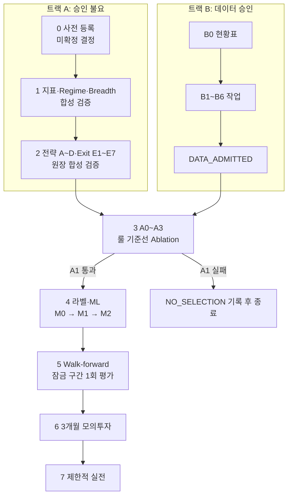

# PRD v1 실행 계획

기준 문서: [AI 알고리즘 트레이딩 백테스팅 PRD Draft v1.0](../AI_알고리즘_트레이딩_백테스팅_PRD.md)
작성일: 2026-09-23
브랜치: `research/prd-v1-data-20260923`
상태: 트랙 B(데이터 정리) 진행 중. 실제 수익률 실행은 `BLOCKED`, 최종 선택은 `NO_SELECTION`.

## 1. 진행 방식

PRD 를 순서대로 진행하되 승인 없이 할 수 있는 일(트랙 A)과 데이터 승인(트랙 B)을 병렬로 둔다. 3단계부터는 두 트랙이 모두 끝나야 시작한다. PRD §5.2 는 승인 전에 합성 데이터 테스트까지만 허용한다.

룰 기준선이 통과하지 못하면 AI 필터가 걸러 낼 대상이 없으므로 4단계로 가지 않는다(PRD §19.2).

## 2. 단계별 작업

| 단계 | 작업 | 재사용할 기존 자산 | 새로 할 것 | 완료 기준 |
| --- | --- | --- | --- | --- |
| 0 | 사전 등록 | [`../experiment-spec.md`](../experiment-spec.md), [`registry.py`](../../../research/krx_lab/registry.py) | PRD §4 결정을 확정하고 기간을 분할하며 후보 수 상한을 정한다. | 평가 기간과 잠금 구간이 커밋된다. |
| 1 | 지표 엔진 | [`indicators.py`](../../../research/krx_lab/indicators.py)에는 ATR·EMA/SMA·Wilder RSI 만 있다. | ADX·±DI, 볼린저 밴드, MACD, OBV 기울기, Volume Ratio, 신고가 거리, Trend Score, Breadth 를 추가한다. | 합성 fixture 가 독립 계산과 일치한다. |
| 2 | 백테스터 | [`execution.py`](../../../research/krx_lab/execution.py), [`ohlcv20_execution.py`](../../../research/krx_lab/ohlcv20_execution.py), [`corporate_actions.py`](../../../research/krx_lab/corporate_actions.py), [`metrics.py`](../../../research/krx_lab/metrics.py) | Entry A~D, Exit E1~E7, ATR 사이징, 체결 예외, 5종 원장을 구현한다. | 원장 독립 재생 결과가 엔진과 일치한다. |
| B | 데이터 승인(트랙 B, 병렬) | [`admission.py`](../../../research/krx_lab/admission.py), [`real_admission.py`](../../../research/krx_lab/real_admission.py), v3 SEALED 스냅샷 | 아래 §3 을 참조한다. | `DATA_ADMITTED` 판정을 받는다. |
| 3 | 룰 기준선 | v3 실행 경로 | A0~A3 를 비교하고 Regime·연도·종목 집중도를 확인한다. | 통과하거나 이유를 남기고 종료한다. |
| 4 | 라벨·ML | 없다. | Triple Barrier 라벨링, purge·embargo 분할, sklearn·LightGBM 의존성을 추가한다. | 비용을 차감한 OOS 성과를 확인한다. |
| 5 | Walk-forward | 없다. | fold 별 재학습, 스트레스 테스트, 잠금 구간 1회 평가를 수행한다. | 승인 후보를 정하거나 `NO_SELECTION` 으로 종료한다. |
| 6~7 | 모의·실전 | [`../paper-live-news-roadmap.md`](../paper-live-news-roadmap.md) 등 문서뿐이다. | 브로커 연동, 대사, Kill Switch 를 구현한다. | G0~G6 게이트를 통과한다. |

6~7단계는 주문 시스템이 필요해 별도 프로젝트에서 할 가능성이 크므로, 이 리포의 v1 범위는 5단계까지로 잡는다.

## 3. 트랙 B: 데이터 정리

### 3.1 데이터 현황

| PRD 항목 | 상태 | 규모 | 남은 문제 | 근거 |
| --- | --- | --- | --- | --- |
| 종목 일봉 | 부분 | 2014~2023-12-28 구간에 수정가 4,574,759행·2,312종목, 원가 5,099,694행·2,787종목이 있고 준비된 cohort 는 1,076종목·2,243,249행이다. | 원가 OHLC≤0 중 정지·무거래로 설명되지 않는 18건(B4), 수정가 부재 475건, 250봉 미달 306건, 미해결 행사 160건, 미설명 수정계수 1,061건이 남아 있다. | [postgresql-readiness README](postgresql-readiness-2026-09-21/README.md), [cohort.json](../../../../vectorbt-data/krx-v3-20260921-prepared-r2/cohort.json) |
| 시장 지수 | 확보 | KOSPI·KOSDAQ 2014-01-02~2023-12-28 각 2,459일을 보유한다. | 2026년 재수집 자료라 당시 원응답 보존 여부가 미확인이다(`historical_capture=false`). | [extension-benchmark-admission-2026-09-21/](extension-benchmark-admission-2026-09-21/) |
| 종목 마스터 이력 | 부분 | 식별자 이력 907,098행, 보통주 유효기간 31,475행(KOSPI 6,861·KOSDAQ 24,614)을 보유한다. | 전체 member 해시 재계산과 가격쌍 대조를 실행하지 않았다. 2,787종목은 전부 보통주다. 상장일은 2,364종목(`stock`)만 있고 12종목은 원천끼리 다르다. 폐지 근거는 398종목에 있고, 90일 이상 일찍 끊긴 284종목 중 30종목은 근거가 없다(B1b). | [postgresql-readiness README](postgresql-readiness-2026-09-21/README.md), [B1b 대조](prd-v1-data-2026-09-23/README.md#b1b-상장폐지거래정지-대조) |
| 기업행사·조정계수 | 부분 | 계수 v2 는 가격 643/733건, 거래량 539/733건이 승인되었고 배정비율은 104키(84종목) 중 불일치 50건·미해석 54건이다. | 미승인 194키가 4,670종목·일에 영향을 주고, 006740 은 공급자 입력이 아직 연결되지 않았다. | [ohlcv20-factor-v2-intake README](ohlcv20-factor-v2-intake-2026-09-23/README.md), [006740 revision 연결안](006740-provider-revision-link-plan-2026-09-23.md) |
| 수량 정산 | 부분 | `CorporateActionBook` 이 무상증자·주식배당 신주를 정산한다(B3, 합성 검증). | OHLCV20 탐색의 176건 제외는 별도 무효화 경로에서 나오므로 B3b 연결 전까지 그대로다. 미승인 배정비율 사건은 실패로 막힌다. | [B3 결과](prd-v1-data-2026-09-23/README.md#b3-무상증자주식배당-수량-정산) |
| 거래 캘린더 | 확보 | 공식 달력 3,652일 중 개장일 2,459일을 보유한다. | 없다. | [calendar.parquet](../../../../vectorbt-data/krx-v3-20260921-prepared-r2/calendar.parquet) |
| 비용표 | 부분 | 실행 규칙 15행을 보유한다. 거래세 세율은 원문과 일치한다(B2b). | 원천에 2014년 거래세 공백과 결제일 기준 경계가 있어 ted-startup 에 수정을 요청했다(R1). 수수료는 사용자 가정(0.015%)이고 농특세·호가·가격제한은 원문 미재확인이다. | [B2b 결과](prd-v1-data-2026-09-23/README.md#b2b-효력일별-비용표), [요청 목록](prd-v1-data-2026-09-23/requests/README.md) |
| 거래정지·유동성 | 부분 | 거래상태 292행(정지 279·무봉 정지 1·부분거래 12)을 보유한다. | 정지 공시(KOSDAQ 3,834·KOSPI 15건)는 해제 이벤트가 부족해 구간 끝이 불확실하다. 무거래 135,419행 중 정지로 설명되는 행은 53,007~104,067행이고, KOSPI 21,409행은 판별할 원천이 없다(B1b). 가격제한 도달과 부분체결 판정은 엔진 쪽 작업이다. | [B1b 대조](prd-v1-data-2026-09-23/README.md#b1b-상장폐지거래정지-대조) |
| 업종 이력 | 없음 | 해당 없다. | point-in-time 업종 자료가 없어 이전에 업종 상한을 제거했다. | [cohort.json](../../../../vectorbt-data/krx-v3-20260921-prepared-r2/cohort.json)의 `POINT_IN_TIME_SECTOR_UNAVAILABLE` |

지수와 캘린더는 확보되었고, 가장 큰 공백은 Universe 가 1,076종목으로 좁혀져 있다는 점과 무상증자·주식배당 수량 정산이다. 2026-09-13 기록의 종가 0원 1,201행은 v3 소비 뷰에서 재현되지 않으므로 현재 차단 사유가 아니다.

### 3.2 작업 목록

| ID | 작업 | 필요한 것 | 선행 | 상태 |
| --- | --- | --- | --- | --- |
| B1 | PRD §5.3 기준으로 Universe 를 진단해 1,711종목 제외 사유를 데이터 결함·전략 자격(250봉)·정책으로 나누고 PRD 기준(보통주·상장 120거래일·상장폐지 포함)으로 재구성 가능한 범위를 집계한다. | 코드(읽기 전용 분석) | 없음 | 완료(진단), [결과](prd-v1-data-2026-09-23/README.md) |
| B1b | PostgreSQL 에서 상장·폐지·거래정지를 읽기 전용으로 추출해 로컬 자료와 대조한다. 뷰 `backtest_universe_v2`·`backtest_status_v2` 는 로컬과 같아 기반 테이블(`stock`·`instrument_history`·`market_status_event`·`trading_halt`)을 썼다. | 코드, 홈서버 DB 접근(`ssh home`) | B1 | 완료(대조), [결과](prd-v1-data-2026-09-23/README.md#b1b-상장폐지거래정지-대조) |
| B2 | 증권거래세·농어촌특별세·가격제한폭·호가단위의 2014~2023 변경 이력을 공식 근거와 함께 표로 확정한다. | 외부 원천(공개 법령) | 없음 | 완료(조사, 2차 출처), [결과](prd-v1-data-2026-09-23/README.md) |
| B2b | 비용표를 `rules.parquet` 형식의 효력일별 표로 반영하고 법령 원문으로 재확인한다. | 코드, 외부 원천 | B2 | 원문 확인 완료, 원천 수정은 ted-startup 대기([R1](prd-v1-data-2026-09-23/requests/r1-execution-rule-sell-tax.md)) |
| B3 | 무상증자·주식배당 수량 정산을 `corporate_actions.py` 에 추가하고 합성 fixture 로 검증한다. | 코드 | 없음 | 완료(합성 검증), [결과](prd-v1-data-2026-09-23/README.md#b3-무상증자주식배당-수량-정산) |
| B3b | OHLCV20 탐색 경로(`ohlcv20_exploratory.py` 의 무효화 규칙)가 승인된 신주 사건을 제외하지 않고 B3 정산을 쓰도록 연결한다. | 코드 | B3 | 대기 |
| B4 | 원가 OHLC≤0 135,717행을 거래정지·무거래와 대조해 설명되지 않는 행만 남긴다. | 코드 | B1 | 완료(18건 확정), [결과](prd-v1-data-2026-09-23/README.md#b4-원가-ohlc0-대조) |
| B5 | member 해시를 재계산하고 가격쌍 완전성을 대조해 Gate A 를 전수 검증하고 최종 종목을 확정한다. | 코드 | B1, B4 | 대기 |
| B6 | 조정계수 미승인 194키의 영향 종목·일을 Universe 에서 제외할지 원문을 보완할지 결정한다. | 사용자 결정, 외부 원천(ted-startup) | B1 | 대기 |
| B7 | 종목에 귀속되지 않는 이슈 1,523행을 원천(ted-startup)과 연결해 종목·일로 귀속한다. | 외부 원천, 코드 | B1 | 요청서 작성, ted-startup 대기([R2](prd-v1-data-2026-09-23/requests/r2-issue-attribution.md)) |

B1b 로 상장·폐지 근거는 확보했으나 KOSPI 정지일과 상장일 기준(원천 불일치 12종목)은 남아 있다. B3 은 끝났고, B3b 는 실제 수익률 실행 경로를 건드리므로 `BLOCKED` 해제 조건과 함께 다룬다.

## 4. 사용자가 정할 사항

| ID | 결정 사항 | 배경 | 막히는 단계 |
| --- | --- | --- | --- |
| D1 | OOS 기간 설계 | OHLCV20 탐색이 2021~2023 은닉 구간을 이미 공개했으므로 깨끗한 OOS 는 2024-01-01 이후 잠금 구간뿐이다. | 0, 5 |
| D2 | 재수집 지수의 수용 여부 | 지수는 인수되었지만 당시 원응답이 아니라 2026년 재수집 자료다. | 1(Regime), 3(A2·A3) |
| D3 | 섹터 한도 | 이전 결정은 업종 상한 제거이고 PRD §8.3 은 섹터 30% 를 요구하는데, point-in-time 업종 자료가 없다. | 2 |
| D4 | 조정계수 미승인 키 처리 | 내용은 위 B6 을 참조한다. | B |
| D5~D13 | PRD §28 의 미확정 9개 | Universe 필터, 가격 정책, 비용 모델, Regime 지속일, 리밸런싱, 라벨 처리, 창 길이, 모의 기준, 실전 한도가 남아 있다. | 0 |

D1~D4 는 이 리포의 이전 결정이나 데이터 가용성에 달려 있어 PRD 만으로 정할 수 없다.

## 5. 제약

- 2024-01-01 이후 잠금 구간은 별도 승인 전까지 열지 않는다.
- 차단 사유를 임의로 보정하지 않는다. 이상값을 삭제하거나 전일값으로 대체하지 않고 원인과 영향 종목을 기록한다.
- 운영 DB 와 봉인 입력은 읽기 전용으로 다룬다.
- 기존 로컬 Parquet(`../vectorbt-data/`)을 재사용한다. 이 자료는 Git 으로 전달되지 않는다.
