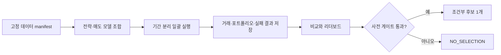

# Backtest Lab PRD

## 목적, 결론, 범위와 한계

이 제품은 국내주식 기술적 전략 여러 개를 같은 데이터·비용·체결 가정에서 일괄 백테스트하고, 모든 실행 결과를 보존·비교·분석하여 사전 게이트를 통과한 조건부 최고 후보 **하나**를 선정하기 위한 연구용 랩이다.

**현재 결론:** 지금은 전략을 선정할 수 없다. `최고`는 전체 기간의 최대 수익률이 아니라, 사전에 고정한 데이터·실행 가능성·기간 분리·위험 게이트를 통과한 후보 중 하나다. 통과 후보가 없으면 `NO_SELECTION`이 정상 결과다.

**이번 범위:** 기술 분석만의 과거 연구와 결과 관리다. AI 뉴스, 증권사 실시간 조건검색, 모의투자, 실전 주문은 후속 단계이며 이 제품이 연결하거나 실행하지 않는다. 구현도 다음 단계의 일이며 이번 산출물은 문서 설계다.

## 배경과 문제

현재 데이터는 2026-09-13 관측 기준 2015-01-02~2026-09-10의 adjusted OHLCV 8,789,127행·5,011종목이다. 종가 0 행 1,201개가 남아 있고 가격 계보와 역사적 유니버스가 미해결이다. 이 상태에서는 전체 10년 최대 수익 결과를 투자 가능 전략으로 해석할 수 없다.

현재 `research_backtest`는 단일 종목·10봉 합성 검증에 한정된다. 이 PRD가 요구하는 다전략·다종목·포트폴리오 일괄 실행, 전체 결과 저장, 비교·분석, 조건부 후보 선정 프로그램은 아직 존재하지 않는다.

## 사용자와 핵심 질문

연구 사용자는 다음 질문에 재현 가능한 답을 얻어야 한다.

1. 동일 데이터와 운용 가정에서 어떤 기술 전략이 어떤 기간·시장 상태에서 작동하거나 실패했는가?
2. 매수 전에 이익실현가와 손절가를 함께 정하고도 비용·갭·일봉 충돌을 고려하면 성과가 남는가?
3. 초기 원금 1억 원을 이익 재투자할 때, 최대 20종목 기본 상한에서 금액 확대와 종목 수 확대 중 어느 정책이 더 견고한가?
4. 사전 게이트를 통과한 조건부 최고 후보가 있는가, 아니면 `NO_SELECTION`인가?

## 제품 흐름

실행 전에는 데이터 manifest, 전략·매도 규칙 버전, 비용 가정, 기간 분리, 포트폴리오 규칙을 고정한다. 실행 후에는 성공·실패·중단·재개 모두 같은 실행 식별자 아래 보존한다. 리더보드는 결과 탐색 도구이고, 후보 선정은 별도 사전 게이트가 수행한다.

## 운용 모델의 고정된 방향

### 자금과 보유

- 초기 연구 원금은 1억 원이다.
- 별도 비상자금 1~2억 원은 외부 계정이며 자동 편입, 자동 이체, 자동 인출 대상이 아니다.
- 연구 기간의 인출은 0으로 두고 계좌 손익을 반영한 평가액으로 다음 신규 주문 규모를 조절하고 실제 가용 현금 범위에서 재투자한다. 미실현 이익을 현금으로 간주하지 않는다.
- 최대 20종목은 기본 상한이다. 자산 성장 시 종목 수 확대와 종목당 금액 확대는 각각 별도 정책으로 비교한 뒤 채택한다.
- 이 값들은 연구 초기조건이며 실전 자본·손실 한도 승인이나 수익 보장이 아니다.

### 진입과 청산

기술 신호는 완료된 거래일 데이터로 생성한다. 진입 계획에는 전일 종가와 ATR 등 전략 입력으로 이익실현가와 손절가를 **둘 다** 확정하고, 다음 거래일 시가에 매수 가능 가격 범위 안에서만 진입을 시도한다. 실제 체결가가 예상과 달라도 체결 뒤 목표·손절 가격을 임의로 새로 계산하지 않는다.

최대 보유 기간은 단기 기준으로 `entry_date + calendar 1 month`의 말일 clamp다. 그 날이 비거래일이면 직전 거래일 시가에 시간 청산을 시도한다. 거래정지 등으로 팔 수 없으면 강제 체결로 기록하지 않고 예외 초과 보유와 재시도를 기록한다.

가격 기반 손절·이익실현·시간 청산 중 가장 먼저 발생한 것이 청산 후보가 된다. 일봉 한 봉에서 손절과 이익실현이 함께 닿은 경우 기본 실행은 손절 우선이며, 갭과 체결 불가 가정을 별도 민감도로 공개한다. 정확한 전략 식과 충돌 처리 표는 [전략 명세](strategy-spec.md)에서 관리한다.

## 성공 기준

제품은 단일 최고 수익률을 제시하는 대신 다음을 만족해야 한다.

- 한 번의 일괄 실행으로 모든 전략·기간·포트폴리오 정책의 결과와 오류를 저장한다.
- 특정 결과는 입력 데이터 manifest, 코드·설정·전략 버전, 실행 시각으로 다시 재현할 수 있다.
- 리더보드는 수익·위험·거래·미체결·데이터 제외를 함께 보여 주며 실패를 숨기지 않는다.
- 선정 규칙은 실행 전에 고정하며, 어느 후보도 통과하지 못하면 `NO_SELECTION`을 낸다.
- HTS 이식 가능성은 기술 조건의 대응 태그와 미확정 차이를 표시할 뿐, HTS 동일성이나 실시간 주문 가능성을 주장하지 않는다.

## 비목표와 위험

이 PRD는 특정 전략 파라미터, 실험 조합 수, 사전 정렬 기준, 기술 CLI를 정하지 않는다. 이는 사용자가 조정하는 [전략 명세](strategy-spec.md)와 [기술 명세](technical-spec.md)에 둔다.

허용 최대낙폭은 미정이다. 연구 스트레스의 10%·20%·30% MDD는 비교를 위한 제안일 뿐 실전 승인선이 아니다. adjusted-only 가격, 가격 계보, 역사적 종목군, 종가 0과 OHLC 비양수 원인이 해결되기 전에는 연구 결과에 데이터 한계를 표시한다.

## 연계 산출물과 다음 단계

- [WBS](wbs.md): 단계·담당·의존성·완료 기준
- [전략 명세](strategy-spec.md): 전략군, 청산 충돌, 비용·갭 민감도
- [기술 명세](technical-spec.md): 스키마, 실행 단위, 저장·재개 구조
- [README](README.md): 이 랩의 사용 순서와 문서 색인
- [요구사항](requirements.md): 기능·비기능 요구사항과 인수 기준

다음 구현 단계의 첫 관문은 데이터 품질과 역사적 유니버스의 연구 가능 범위를 고정하는 일이다. 그 뒤 전략 명세에서 허용한 조합만 실행하고, 결과가 있어도 선정 게이트를 통과하기 전에는 후속 AI·모의·실전 단계로 넘기지 않는다.
