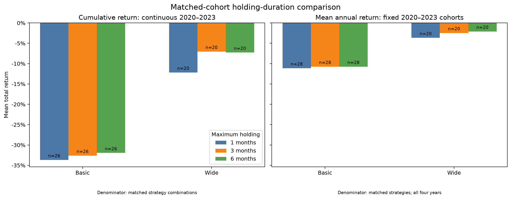
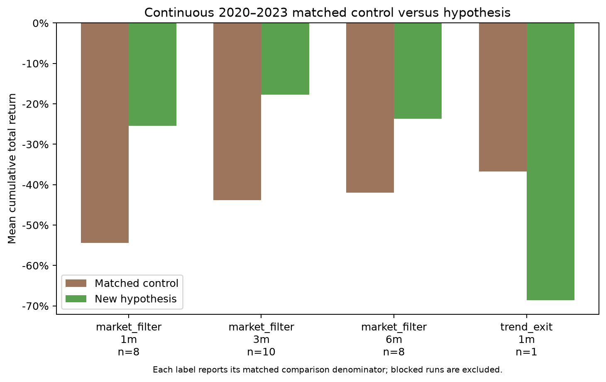

# 결과 해석: 보유기간 연장과 세 신규 전략

최대 보유기간을 3·6개월로 늘리자 기존 전략의 손실과 매매 횟수가 줄었지만, 비교 가능한 전략들의 평균 연수익은 여전히 음수였다. 신규 가설 중에서는 **시장지수 200일선 필터를 붙인 돌파 전략**이 후속 검증 후보로 남았다. 아래는 이미 관찰한 2020~2023년의 탐색 결과이며, 최종 전략 선정이나 새로운 독립 검증 결과가 아니다.

전체 실행 상태와 검증은 [결과 보고서](README.md), 각 전략의 실제 매수·매도 횟수는 [4개년 집계](strategy-annual-totals.md)와 [기간별 상세표](all-strategies.md)에서 확인한다. 차단된 실행에는 완결 수익률을 부여하지 않는다.

## 최대 보유기간 연장은 손실을 줄였지만 평균 수익을 양수로 바꾸지 못했다

2020·2021·2022·2023년과 최대 보유기간 1·3·6개월이 모두 성공한 동일 전략만 비교했다. 수익률은 독립 연도 수익률의 산술평균이며, 4년 누적수익률이 아니다.

| 기존 전략군 | 동일 전략 수 | 최대 1개월 | 최대 3개월 | 최대 6개월 |
| --- | ---: | ---: | ---: | ---: |
| 기본 청산 | 28 | −11.12% | −10.75% | −10.74% |
| 넓은 청산 | 20 | −3.66% | −2.46% | −2.11% |

최대기간이 길어도 손절·익절이 먼저 발생한다. 실제 종료 거래의 평균 보유일은 기본 청산이 약 4.70→5.14→5.12일, 넓은 청산이 15.44→23.11→24.14일이었다. 따라서 이번 결과는 모든 종목을 3개월·6개월 동안 반드시 보유한 결과가 아니다. 직전 보고서의 기본·넓은 청산 21쌍 비교와는 포함 기준이 달라 표본 수와 평균이 다르다.

## 세 신규 가설 중 시장 필터에 후속 검증 근거가 있었다

1. **월간 상대 모멘텀:** 성공한 2021년 −30.88%, 2023년 −3.78%. 2020·2022년과 4년 연속 실행은 보유 종목 평가 불확실성으로 차단되었다. 두 성공 연도를 4개년 성과처럼 집계할 수 없다. 동일 종목군 전체시장 동일가중 대조군도 없어 상대강도 자체의 초과수익은 확정하지 않았다.
2. **시장지수 200일선 필터:** 4년 연속 실행에서 대응 가능한 조합의 평균 손실과 낙폭이 감소했다. 다만 평균은 여전히 음수였고, 투자비중 감소의 영향도 있다. 일부 개별 전략은 양의 수익률을 보여 추가 검증 후보로 남겼다.
3. **직전 20거래일 저가 이탈 청산:** 4년 연속 대조가 가능한 것은 최대 1개월의 한 조합뿐이었다. 그 조합은 기존 −36.73%에서 변경 후 −68.64%로 악화했다. 3·6개월에 완결 대응 조합이 없어 일반적인 우열 판단에는 부족하다.

## 관찰 후 찾은 후보: 60일 돌파와 시장 필터, 최대 1개월

신규 변형의 성공한 4년 연속 실행 중 누적수익률이 가장 높았던 조건은 `BREAKOUT_60_MARKET200` + `ATR_3_6` + 최대 1개월이다. 해당 시장지수가 200일 이동평균 위일 때 60일 돌파로 진입하며 최초 손절은 3 ATR, 익절은 6 ATR이다. ATR은 최근 가격 변동폭 지표다.

**2020~2023년 연속 누적수익률 +28.55%, 최대낙폭 14.44%, 매수 895회·매도 875회**였다. 평균 투자비중은 32.51%, 종료 거래의 평균 보유기간은 21.44일이며 마지막에 20종목이 남았다. 매수·매도 횟수 차이는 미청산 보유 때문이다.

| 독립 연도 | 수익률 | 매수 체결 | 매도 체결 |
| --- | ---: | ---: | ---: |
| 2020 | +15.01% | 292 | 272 |
| 2021 | +7.42% | 319 | 300 |
| 2022 | −5.54% | 21 | 21 |
| 2023 | +7.04% | 282 | 262 |

독립 연도는 매년 새 계좌로 시작하므로 표의 횟수 합계가 연속 계좌의 횟수와 다르다. 이 후보의 개발기간 실행은 차단되었고, 위 후보는 결과를 본 뒤 골랐다. 따라서 지금 확정 전략으로 채택할 근거는 부족하다. 후속 연구는 차단 자료를 먼저 해결하고, 비교 기준과 선정 규칙을 고정한 뒤 별도 미관찰 기간에서 확인하는 순서가 적절하다. 2024년 이후 자료는 이번 실험에서 열지 않았다.

기말 미청산 20종목의 평가액을 포함한 계좌 수익률이며 전액 현금화 수익률이 아니다. 마지막 거래일 부근 체결에는 결제일이 준비된 달력 범위를 벗어났다는 경고도 남아 있다.

## 비교 그림과 공통 한계

수익률은 날짜별 거래비용 차감 후이며 현금배당은 제외했다. 공통 1,076종목에는 사후 제외 편향이 있다. 개별 연도 종료 시 강제 매도하지 않고 종가 평가하며, 차단 실행의 체결 횟수는 중단 전 부분 기록이다. 시장지수는 공식 원천과 대조했지만 2026년에 재수집한 과거 자료라는 한계가 있다.
