# 48개 기준선과 8개 상대거래량 후보 통합 설명서

## 결론과 문서 목적

이 문서는 `krx_lab-v1`의 **12개 진입 × 4개 청산 = 48개 기준선**과 다음 실험의 **20일·60일 돌파 + 상대거래량 1.5배, 2개 진입 × 4개 청산 = 8개 후보**를 한곳에서 검토하기 위한 통합본이다. 기존 48개는 변경하지 않으며, 상대거래량 후보는 별도 실험·새 스키마 버전으로만 실행한다. OBV와 거래량 위축 후 급증은 여기의 8개 후보에 섞지 않고 [별도 사전등록](volume-strategy-preregistration-2026-09-21.md)으로 분리했다. 전략명은 검증된 수익모형이 아니라 결과 확인 전에 고정한 **연구 가설 ID**다. 현재 실자료는 실행 적격 인수를 통과하지 않아 실제 수익률과 최종 전략은 아직 없으며, 합성 실행 성공도 시장 성과를 의미하지 않는다.

**알려진 것은 이동평균·돌파·RSI·볼린저 밴드·MACD·거래량·손절 같은 구성요소다. 이 저장소의 정확한 48개 기준선과 8개 상대거래량 조합 성과는 알려져 있지 않다.** 기존 연구에는 관련 백테스트 결과가 있지만 시장, 기간, 종목군, 비용, 체결시점과 청산 규칙이 다르다. 따라서 다른 연구의 수익률 숫자를 한국 주식 예상수익률로 옮기지 않고, 5절에 결과 확인 전 고정하는 정성적 사전 기대를 전략별로 기록한다.

**기간 충돌:** 현재 `config.py`의 개발 시작일은 2015-01-02지만, 최신 [백테스팅 데이터 요구사항](backtest-data-requirements-2026-09-20.md)은 가격제한폭 30% 체제의 첫 거래일인 2015-06-15부터 평가하도록 강화했다. 첫 평가일까지 250개 공식 거래일을 확보하려면 최소 2014-01-01부터 수집해야 하며 2014-01-01~2015-06-14는 준비에만 사용한다. 정식 실자료 실행 전 config·계약 버전을 함께 갱신해야 한다.

읽는 순서: 1절은 모든 후보가 공유하는 거래 계약, 2~3절은 진입·청산 가설, 4절은 외부 연구에서 확인된 범위와 한계, 5절은 48개 기준선과 8개 상대거래량 조합의 사전 기대와 확인 질문, 6절은 구현이 끝난 기존 48개 조합의 매수·매도 차트, 7절은 비교·탈락·선정 방법, 8절은 현재 실행 상태다. OBV·거래량 위축 실험의 정확한 분리는 별도 사전등록 문서를 먼저 읽는다.

## 1. 모든 전략에 공통인 실행 계약

- 신호 지표는 완료된 `t`일 조정 OHLC와 원거래량(raw volume)으로 계산하고 다음 공식 거래일 시가에서 한 번만 진입을 시도한다. 거래량 10만주 조건과 유동성 수량 한도에도 raw volume을 사용한다. `t+1`의 고가·저가·종가·거래량을 진입 결정에 사용하지 않는다.
- 종목별 연속 완전봉 250개와 `V(t-1) ≥ 100,000주`를 요구한다. 현재 `strategies.py`는 최근 250개 **입력 행**의 완전성만 검사하므로 입력 어댑터가 공식 거래일로 먼저 재인덱싱해야 한다. 결측 구간과 영구 종목 ID 변경을 넘어 지표 이력을 연결하지 않는다.
- 초기 현금은 1억원, 외부 입출금·레버리지·공매도·분수주는 없다. 최대 20종목, 목표 총노출 80%, 슬롯당 목표 4%, 종목당 상한 5%, 업종 25%, 거래당 계획손실 0.5%, 직전 20일 평균 raw 거래량의 0.1% 한도를 적용한다.
- 신호일에 진입 상한 `B=min(C+0.5×ATR14, 1.01×C)`와 손절·목표를 고정한다. `0 < 손절 < 다음 시가 ≤ B < 목표`일 때만 정수주로 진입한다.
- 최대 보유기간은 진입일부터 달력 1개월이다. 갭 손절, 같은 봉 손절·목표 동시 접촉 시 손절 우선, 거래정지 시 다음 체결 가능일 재시도를 적용한다.
- 비용 10/30/50bp와 진입 지연 1/2일은 견고성 비교용 가정이다. 최종 판단에는 날짜·계좌별 실제 수수료·세금·호가·체결 모형이 별도로 필요하다.

다음 도식은 신호 판정부터 매도까지의 공통 순서를 압축해 보여 준다. `B`는 진입 상한, `S`는 손절가, `T`는 목표가다.

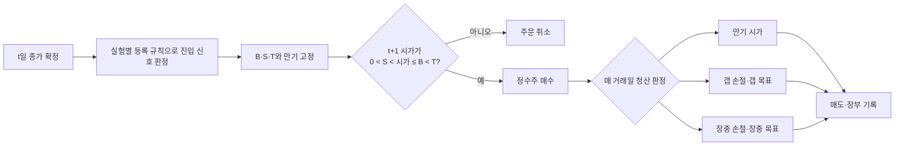

## 2. v1의 12개 진입과 다음 실험의 2개 진입이 확인하려는 것

전략 ID는 `진입 ID__청산 ID` 형식이다. 이중 밑줄(`__`) 앞은 **언제 살지**, 뒤는 **어디서 손절·익절할지**를 뜻한다. 예를 들어 `CROSS_5_20__PCT_3_6`은 “5일선이 20일선을 상향 돌파하면 매수하고, 신호일 종가 기준 3% 손절·6% 익절을 적용하는 전략”이다.

`C`는 종가, `SMA`는 단순이동평균, `RSI14`는 Wilder RSI, `Lower20(k)`는 20일 평균에서 `k` 표준편차(`ddof=0`) 아래 밴드, `MACD`는 SMA로 초기화한 EMA12−EMA26과 EMA9 신호선이다. `ATR14`(Average True Range, 14일 평균 실제 변동폭)는 전일 종가와 당일 고가·저가의 관계를 반영한 하루 변동폭인 true range를 최근 14일간 단순평균한 값이다. 모든 조건은 `t`일 종가 확정 뒤 판정한다. 아래 “확인하려는 가설”은 규칙에서 도출한 연구 해석이며 코드가 보장하는 사실이나 수익 예측이 아니다.

| 진입 ID | 읽기 쉬운 이름 | 정확한 핵심 조건 | 확인하려는 가설 | 반증·주의 신호 |
| --- | --- | --- | --- | --- |
| `CROSS_5_20` | 5·20일 이동평균 골든크로스 | 전일 SMA5<SMA20, 당일 SMA5>SMA20 | 빠른 단기 추세 전환이 이후 상승으로 이어지는가 | 거래 과다·비용 민감·횡보장 연속 손절 |
| `CROSS_10_20` | 10·20일 이동평균 골든크로스 | 전일 SMA10<SMA20, 당일 SMA10>SMA20 | 느린 교차가 잡음을 줄이고 더 안정적인 전환을 잡는가 | 신호 지연으로 기대수익 감소·거래 부족 |
| `BREAKOUT_20` | 20일 신고가 돌파 | `C(t)`가 직전 20종가 최고치 초과 | 단기 신고가 돌파 뒤 모멘텀이 지속되는가 | 돌파 직후 되돌림·높은 갭 거절률 |
| `BREAKOUT_60` | 60일 신고가 돌파 | `C(t)`가 직전 60종가 최고치 초과 | 더 희소한 중기 신고가가 강한 추세를 선별하는가 | 표본 부족·늦은 진입·집중도 증가 |
| `TREND_PULLBACK_3` | 60일 상승추세의 3일 3% 눌림목 | C>SMA60, 3일 수익률≤−3% | 상승 추세의 완만한 조정 뒤 반등이 있는가 | 하락 지속·작은 조정의 신호 과다 |
| `TREND_PULLBACK_5` | 60일 상승추세의 3일 5% 눌림목 | C>SMA60, 3일 수익률≤−5% | 더 깊은 조정이 반등 여력과 위험을 함께 키우는가 | 추세 붕괴 포착·갭 손실·낙폭 증가 |
| `RSI_REENTRY_30` | 상승추세 RSI 30 과매도 회복 | C>SMA60, RSI가 30 아래에서 30 이상으로 복귀 | 상승 추세 안의 깊은 과매도 회복이 유효한가 | 신호 희소·회복 실패·특정 장세 의존 |
| `RSI_REENTRY_40` | 상승추세 RSI 40 약세 회복 | C>SMA60, RSI가 40 아래에서 40 이상으로 복귀 | 덜 깊은 약세에서 빠른 회복을 잡는 편이 나은가 | 거짓 회복·거래 증가로 비용 악화 |
| `BOLLINGER_REENTRY_1_5` | 상승추세 볼린저 1.5σ 하단 복귀 | C>SMA60, 전일 하단 1.5σ 아래→당일 밴드 이상 | 비교적 흔한 하방 이탈의 평균회귀가 존재하는가 | 신호 과다·약한 이탈의 낮은 기대값 |
| `BOLLINGER_REENTRY_2` | 상승추세 볼린저 2σ 하단 복귀 | C>SMA60, 전일 하단 2σ 아래→당일 밴드 이상 | 극단적 하방 이탈 뒤 회복이 더 강한가 | 표본 부족·급락 종목 집중·갭 위험 |
| `MACD_CROSS_SMA60` | 60일 상승추세 MACD 골든크로스 | C>SMA60, MACD가 신호선을 상향 돌파 | 중기 상승 추세에서 모멘텀 재가속이 유효한가 | 후행 신호·횡보장 교차 반복 |
| `MACD_CROSS_SMA120` | 120일 상승추세 MACD 골든크로스 | C>SMA120, MACD가 신호선을 상향 돌파 | 장기 상승 추세 필터가 MACD 잡음을 더 줄이는가 | 지나친 필터로 거래 부족·늦은 진입 |

같은 군의 두 후보는 한 요소만 바꾼 비교쌍이다. `5↔10`, `20↔60`, `−3↔−5`, `30↔40`, `1.5σ↔2σ`, `SMA60↔SMA120` 비교로 민감도와 표본 감소의 대가를 확인한다.

`CROSS`·`BREAKOUT`·`TREND_PULLBACK`은 기존 조건식에 대응시키려는 후보지만 실제 HTS 신호 일치는 아직 검증되지 않았다. `RSI_REENTRY`·`BOLLINGER_REENTRY`·`MACD_CROSS`는 Python 연구 전용 정의다. 이름이 비슷하다는 이유로 증권사 조건검색과 동일하다고 간주하지 않는다.

### 다음 실험에는 돌파 + 상대거래량 두 후보만 추가한다

상대거래량(`RVOL`, Relative Volume)은 당일 원거래량을 직전 20개 비교 가능 거래일의 평균 원거래량으로 나눈 값이다. 당일 종가와 거래량이 모두 확정된 뒤 신호를 만들고 다음 공식 거래일 시가에 진입하므로 미래정보를 사용하지 않는다.

`RVOL20_t = V_t / mean(V_{t-20}, …, V_{t-1})`

| 진입 ID | 읽기 쉬운 이름 | 정확한 핵심 조건 | 가장 가까운 대조군 |
| --- | --- | --- | --- |
| `BREAKOUT_20_RVOL_1_5` | 20일 신고가·상대거래량 1.5배 돌파 | `C_t > max(C_{t-20}…C_{t-1}) ∧ RVOL20_t >= 1.5` | `BREAKOUT_20` |
| `BREAKOUT_60_RVOL_1_5` | 60일 신고가·상대거래량 1.5배 돌파 | `C_t > max(C_{t-60}…C_{t-1}) ∧ RVOL20_t >= 1.5` | `BREAKOUT_60` |

분모에는 당일 `V_t`를 넣지 않는다. 직전 20개 거래량 중 결측·미확정 거래상태가 있거나 평균이 0이면 해당 종목·평가구간은 `BLOCKED`다. 수량계수가 바뀌는 기업행사가 20일 비교창에 걸치면 거래량 기준이 달라질 수 있으므로, 인수된 수량계열로 비교 가능성이 입증되지 않는 한 해당 fold 전체에서 후보를 선정하지 않는다. 이를 단순 거짓 신호 또는 표본 제외로 바꾸지 않는다. 공통 `V_{t-1} >= 100,000주` 조건도 그대로 적용한다.

이 두 진입과 기존 4개 청산의 직교 조합이 **신규 8개 후보**다. 변경하지 않은 v1 기준선 48개를 합치면 다음 실험의 전체 카탈로그는 **14개 진입 × 4개 청산 = 56개**다. `krx-lab-v1`의 잠금은 유지하고 코드·설정·fixture를 수정하기 전 새 스키마 버전과 실행 manifest를 만든다. 임계값 1.5를 결과에 맞춰 바꾸거나 2.0을 같은 선정 경쟁에 추가하지 않는다.

## 3. 4개 청산 규칙이 확인하려는 것

모든 청산은 신호일 종가 또는 ATR로 미리 정하며 명목상 손익비는 1:2다. `PCT`는 percentage(퍼센트)의 약자로, 종목의 평소 변동폭과 관계없이 종가 대비 고정 비율을 적용한다. `ATR`은 Average True Range(평균 실제 변동폭)의 약자로, 최근 14일의 가격 변동폭에 비례해 손절·목표 거리를 조절한다.

예를 들어 신호일 종가 `C=10,000원`, `ATR14=400원`이면 `PCT_3_6`의 손절·목표는 9,700원·10,600원이고, `ATR_1_5_3`은 9,400원(`C−1.5×400`)·11,200원(`C+3×400`)이다. 따라서 PCT 방식은 모든 종목에 같은 비율을 쓰고, ATR 방식은 평소 변동이 큰 종목일수록 손절·목표 간격도 넓어진다.

| 청산 ID | 읽기 쉬운 이름 | 손절 / 목표 | 확인하려는 가설 |
| --- | --- | --- | --- |
| `PCT_3_6` | 고정 3% 손절·6% 익절 | `0.97C / 1.06C` | 좁은 고정 밴드가 손실을 빨리 제한하고 짧은 상승을 실현하는가 |
| `PCT_5_10` | 고정 5% 손절·10% 익절 | `0.95C / 1.10C` | 넓은 고정 밴드가 일상 변동을 견디고 큰 추세를 남기는가 |
| `ATR_1_5_3` | 1.5 ATR 손절·3 ATR 익절 | `C−1.5ATR / C+3ATR` | 비교적 좁은 변동성 정규화가 종목 간 위험을 균질화하는가 |
| `ATR_2_4` | 2 ATR 손절·4 ATR 익절 | `C−2ATR / C+4ATR` | 넓은 변동성 정규화가 추세 지속을 더 오래 포착하는가 |

같은 진입에서 네 청산을 비교해 진입 신호와 청산 폭의 관계를 본다. 다만 손절·목표가가 `손절 < 다음 시가 ≤ 진입상한 < 목표` 조건과 위험기반 주문 수량에도 영향을 주므로 실제 체결 종목·횟수가 달라진다. 동일 거래에 청산만 바꾼 순수 효과로 해석하지 않고 신호 cohort와 체결 cohort를 함께 보고한다. 승률만 보지 않고 거래당 손익, 갭 손실, 보유기간, 회전율, 비용과 최대낙폭을 함께 본다.

## 4. 문헌에서 관측된 결과와 이 프로젝트의 사전 기대

관련 전략의 과거 실증 결과는 존재하지만 일관된 수익 보장은 아니다. 초기 연구는 이동평균과 돌파 신호를 지지했고 한국시장 이동평균 연구도 긍정적인 결과를 보고했다. 7,846개 규칙을 비교한 Sullivan·Timmermann·White 연구에서도 100년 DJIA 표본 안의 최선 규칙은 데이터 탐색 편향 보정 후 유의했지만, 1987~1996년 DJIA와 S&P 500 선물의 표본 밖 결과는 재현되지 않았다. RSI와 MACD의 장기 방향 예측 실증도 혼합되어 있다. 이 때문에 아래 문헌은 48개 후보를 만들 근거는 되지만 각 후보의 CAGR·승률·최대낙폭을 미리 정하는 근거가 되지 않는다.

| 계열 | 알려진 연구에서 관측된 내용 | 이 48개에 적용할 수 있는 범위 | 근거 수준 |
| --- | --- | --- | --- |
| 이동평균·가격 돌파 | DJIA 장기 자료에서 이동평균과 trading-range breakout의 매수·매도 신호 차이를 보고했다. 한국시장 연구도 이동평균 전략의 초과수익과 마켓타이밍 가능성을 보고했다. | 추세·돌파 가설을 시험할 이유는 있다. 5/20·10/20·20일/60일과 이 저장소의 체결·청산 성과값은 별도 검증 대상이다. | 부분 직접·중간 |
| 다수 기술규칙 비교 | 7,846개 규칙을 함께 평가한 연구에서 100년 DJIA 표본 안 결과는 편향 보정 후에도 유지됐지만, 사전에 고른 규칙과 S&P 500 선물의 표본 밖 결과는 유지되지 않았다. | 48개 중 사후 최고 수익만 고르면 안 되며 개발·검증·잠금 구간과 `NO_SELECTION`을 유지해야 한다. | 직접·높음 |
| RSI·MACD | 네 주가지수에서 다음 날 상승·하락 **방향 예측 적중률**을 비교한 연구는 짧은 구간의 차이를 발견했지만 장기 평균에서는 무작위 규칙과 비슷해졌다. RSI도 이 문서의 30/40 재진입이 아닌 divergence 규칙이었다. | 거래손익이나 비용 후 수익률 증거가 아니다. RSI/MACD 후보는 널리 알려졌다는 이유만으로 양의 기대수익을 부여하지 않는다. | 간접·낮음 |
| 볼린저 밴드 | 대만 주식 연구는 밴드 접촉 이후 가격 반응이 존재할 수 있음을 보고했다. | 평균회귀 후보의 방향성 근거만 제공한다. 이 문서의 전일 이탈·당일 재진입, SMA60, 1.5σ/2σ 규칙은 별도 가설이다. | 부분 직접·낮음~중간 |
| 상승추세 내 3일 −3%/−5% 눌림 | 동일한 복합 규칙을 검증한 신뢰할 만한 1차 실증을 이번 조사에서 찾지 못했다. | 프로젝트 고유 가설로 취급하고 가장 낮은 사전 확신을 둔다. | 직접 근거 없음·낮음 |
| 고정 손절·ATR 청산 | 손절은 무작위보행에서는 기대수익을 낮출 수 있고 모멘텀 국면에서는 가치를 더할 수 있다는 연구가 있다. 다른 자산의 MACD 연구에서 ATR 청산 결과도 설정별로 달랐다. | 3/6%, 5/10%, 1.5/3ATR, 2/4ATR 중 어느 하나가 우월하다고 미리 정할 수 없다. | 간접·낮음 |

주요 1차 자료는 [Brock·Lakonishok·LeBaron의 이동평균·돌파 연구](https://onlinelibrary.wiley.com/doi/10.1111/j.1540-6261.1992.tb04681.x), [Sullivan·Timmermann·White의 데이터 탐색 편향 연구](https://eprints.lse.ac.uk/119144/1/dp303.pdf), [국내 주식시장 이동평균 횡단면 연구](https://www.kci.go.kr/kciportal/ci/sereArticleSearch/ciSereArtiView.kci?sereArticleSearchBean.artiId=ART002280861), [아시아 4개 시장 이동평균 검증](https://doi.org/10.1108/1525383X200900019), [RSI·MACD 장기 비교](https://journals.plos.org/plosone/article?id=10.1371/journal.pone.0068344), [대만 주식 볼린저 밴드 연구](https://doi.org/10.1016/j.physa.2020.124144), [손절 규칙의 조건부 효과](https://doi.org/10.1016/j.finmar.2013.07.001), [MACD와 ATR 청산 비교](https://doi.org/10.3390/jrfm11030056)다.

### 외부 연구의 대표 결과값

사용자가 예상한 것처럼 기존 백테스트의 결과값은 있다. 아래는 원문에서 조건과 수치를 함께 확인할 수 있었던 대표 사례다. 수익률 정의와 시장이 이 프로젝트와 다르므로 48개 전략의 예상수익률 칸에 복사하지 않는다.

| 연구·구간 | 규칙 선택과 평가 | 보고값 | 이 문서에서의 해석 |
| --- | --- | --- | --- |
| Sullivan 외, DJIA 1897~1996 표본 안 | 7,846개 중 평균수익률 기준 최선 규칙 | 배당 제외·비용 전 연환산 평균수익률 17.17%, 6,310회 거래, 거래당 손익분기 비용 0.27% | 매우 긴 표본에서 기술규칙 가능성을 보였지만 사후 최선 규칙의 결과다. |
| 같은 연구, DJIA 1987~1996 표본 밖 | 1986년까지 선택한 5일 이동평균 규칙 | 연환산 평균수익률 2.8%, 명목 p값 0.322 | 사전에 선택한 규칙은 다음 10년에 유의한 신호를 유지하지 못했다. |
| 같은 연구, S&P 500 선물 1984~1996 표본 밖 | 전체 규칙 중 표본 밖 최선 규칙 | 연환산 평균수익률 9.4%, 명목 p값 0.042, Reality Check p값 0.908 | 단일 최선값은 좋아 보여도 다중 규칙 탐색을 보정하면 유의하지 않았다. |

이 수치들은 지수·선물의 장단기 포지션을 포함하며 이 저장소의 한국 개별주 롱온리, `t+1` 시가, 진입상한, 한 달 만기, 공동계좌 제약과 다르다. 한국 이동평균 연구와 볼린저 밴드 연구는 공개 초록에서 방향성 결과는 확인되지만 이 48개에 옮길 수 있는 동일 정의의 수익률 수치는 제공하지 않아 표에 넣지 않았다.

### 사전 기대결과를 읽는 방법

5절의 “사전 기대결과”는 실제 관측값이나 수익률 예측이 아니다. 같은 진입군 또는 같은 청산군 안에서 **무엇이 상대적으로 늘거나 줄 것으로 예상하는지**를 결과 확인 전에 고정한 방향성 가설이다. 예를 들어 “안정성 후보”는 수익을 보장한다는 뜻이 아니라 거래당 위험과 종목 간 변동성 편차가 상대적으로 작을지 확인한다는 뜻이다. 실제 결과가 반대여도 이 문구를 사후 수정하지 않고 원인과 함께 반증으로 기록한다.

공통적으로 `PCT_3_6`은 짧은 보유와 빠른 손익 확정, `PCT_5_10`은 더 긴 보유와 큰 움직임, `ATR_1_5_3`은 상대적으로 좁은 변동성 정규화, `ATR_2_4`는 두 ATR 방식 중 더 넓은 보유 폭과 오른쪽 꼬리 포착을 예상한다. 0.5% 위험 한도가 주문수량의 지배 제약일 때는 손절 폭이 넓을수록 수량이 줄지만, 종목·업종·총노출·현금·유동성 한도가 먼저 적용되면 수량이 같을 수 있다. 넓은 폭에서 직접 예상하는 변화는 목표·손절 접촉 빈도 감소와 보유·슬롯 점유기간 증가이며, 실제 계획 초과손실은 주로 손절가를 건너뛴 갭과 체결 제약에서 발생한다.

## 5. 48개 전략별 확인 질문과 사전 기대결과

아래 기대는 외부 연구의 수익률을 복사한 값이 아니라 이 구현의 구조에서 도출한 정성적 사전 가설이다. 각 행은 동일한 진입 신호가 해당 청산 방식에서도 비용 후·연도별로 유지되는지 검증한다. “짝 비교”는 같은 청산에서 진입 민감도만 바꾼 가장 가까운 후보다.

| 전략 ID | 전략 이름 | 이 조합에서 확인할 질문 | 사전 기대결과 | 가장 가까운 짝 비교 |
| --- | --- | --- | --- | --- |
| `CROSS_5_20__PCT_3_6` | 5·20일 이동평균 골든크로스 · 고정 3% 손절·6% 익절 | 빠른 추세 전환의 수익이 좁은 고정 3/6% 범위 안에서 신속히 실현되는가 | 빠른 교차의 초기 상승을 짧게 실현해 목표 도달 빈도가 상대적으로 높을 수 있으나 횡보장 반복 손절과 비용에 가장 민감할 것으로 예상한다. | `CROSS_10_20__PCT_3_6` |
| `CROSS_5_20__PCT_5_10` | 5·20일 이동평균 골든크로스 · 고정 5% 손절·10% 익절 | 빠른 교차의 잦은 흔들림을 5/10% 폭이 견디며 큰 추세를 남기는가 | 빠른 교차 뒤 흔들림을 견뎌 더 큰 추세를 잡을 수 있으나 위험 한도가 지배하면 주문수량이 줄고 만기청산과 슬롯 점유기간이 늘 것으로 예상한다. | `CROSS_10_20__PCT_5_10` |
| `CROSS_5_20__ATR_1_5_3` | 5·20일 이동평균 골든크로스 · 1.5 ATR 손절·3 ATR 익절 | 빠른 교차를 변동성 정규화하면 종목별 잡음과 손절 편차가 줄어드는가 | 종목별 변동성을 맞춰 빠른 교차의 잡음을 줄이는 안정성 후보로 예상하며 갭과 변동성 급변이 주요 위험이다. | `CROSS_10_20__ATR_1_5_3` |
| `CROSS_5_20__ATR_2_4` | 5·20일 이동평균 골든크로스 · 2 ATR 손절·4 ATR 익절 | 빠른 교차 후 넓은 ATR 밴드가 추세 지속을 잡고도 낙폭을 통제하는가 | 잦은 교차 중 일부 큰 추세를 오래 포착할 수 있으나 수량 감소 가능성·긴 보유와 상관된 갭 손실이 계좌 낙폭을 키울 수 있다. | `CROSS_10_20__ATR_2_4` |
| `CROSS_10_20__PCT_3_6` | 10·20일 이동평균 골든크로스 · 고정 3% 손절·6% 익절 | 느린 교차의 확인 효과가 좁은 고정 청산에서도 비용 후 남는가 | 느린 확인 신호 뒤 가까운 목표를 신속히 실현할 수 있으나 늦은 진입으로 남은 상승폭이 부족할 수 있다. | `CROSS_5_20__PCT_3_6` |
| `CROSS_10_20__PCT_5_10` | 10·20일 이동평균 골든크로스 · 고정 5% 손절·10% 익절 | 느린 교차와 넓은 고정 밴드가 신호 지연보다 추세 지속 이익을 더 만드는가 | 잡음을 줄인 교차와 넓은 목표가 지속 추세를 포착할 수 있으나 신호 지연과 낮은 목표 도달률을 예상한다. | `CROSS_5_20__PCT_5_10` |
| `CROSS_10_20__ATR_1_5_3` | 10·20일 이동평균 골든크로스 · 1.5 ATR 손절·3 ATR 익절 | 느린 교차에 좁은 ATR 청산을 쓰면 잡음 감소와 위험 균질화가 함께 나타나는가 | 확인된 추세를 변동성에 맞춰 관리해 교차군에서 안정성이 높을 수 있으나 거래 수 부족 가능성이 있다. | `CROSS_5_20__ATR_1_5_3` |
| `CROSS_10_20__ATR_2_4` | 10·20일 이동평균 골든크로스 · 2 ATR 손절·4 ATR 익절 | 느린 교차의 희소 신호를 넓은 ATR 밴드로 보유할 가치가 있는가 | 완만한 중기 추세의 큰 구간 포착을 기대하지만 주문수량 감소 가능성과 한 달 만기가 기대를 제한할 수 있다. | `CROSS_5_20__ATR_2_4` |
| `BREAKOUT_20__PCT_3_6` | 20일 신고가 돌파 · 고정 3% 손절·6% 익절 | 20일 돌파의 초기 모멘텀이 3/6% 안에서 빠르게 완성되는가 | 단기 신고가 직후의 빠른 모멘텀을 수익화할 수 있으나 허위 돌파와 다음 시가 갭 거절에 민감할 것으로 예상한다. | `BREAKOUT_60__PCT_3_6` |
| `BREAKOUT_20__PCT_5_10` | 20일 신고가 돌파 · 고정 5% 손절·10% 익절 | 단기 돌파의 되돌림을 5/10% 폭이 견디고 더 큰 상승을 포착하는가 | 초기 되돌림을 견디며 더 큰 돌파 추세를 잡을 수 있으나 실패 돌파의 손실과 만기 비중도 커질 수 있다. | `BREAKOUT_60__PCT_5_10` |
| `BREAKOUT_20__ATR_1_5_3` | 20일 신고가 돌파 · 1.5 ATR 손절·3 ATR 익절 | 20일 돌파를 ATR로 정규화하면 고변동 종목의 허위 돌파 손실이 줄어드는가 | 변동성이 다른 돌파 종목의 위험을 맞춰 비교적 균형 잡힌 결과를 예상하며 ATR 후행과 갭 위험이 남는다. | `BREAKOUT_60__ATR_1_5_3` |
| `BREAKOUT_20__ATR_2_4` | 20일 신고가 돌파 · 2 ATR 손절·4 ATR 익절 | 단기 돌파 후 넓은 ATR 밴드가 모멘텀 지속을 충분히 보상하는가 | 강한 단기 돌파의 오른쪽 꼬리를 포착할 수 있으나 위험 한도가 지배하면 주문수량이 줄고 보유·슬롯 점유기간이 늘 것으로 예상한다. | `BREAKOUT_60__ATR_2_4` |
| `BREAKOUT_60__PCT_3_6` | 60일 신고가 돌파 · 고정 3% 손절·6% 익절 | 희소한 60일 돌파가 좁은 청산에서도 빠르고 안정적인 후속 상승을 보이는가 | 희소한 강한 신고가가 가까운 목표에 빨리 닿을 수 있으나 큰 추세를 너무 일찍 잘라낼 수 있다. | `BREAKOUT_20__PCT_3_6` |
| `BREAKOUT_60__PCT_5_10` | 60일 신고가 돌파 · 고정 5% 손절·10% 익절 | 중기 신고가와 넓은 고정 밴드가 늦은 진입 위험보다 큰 추세를 남기는가 | 중기 신고가의 지속성을 큰 고정 목표로 수익화할 수 있으나 늦은 진입과 절대 변동성 차이에 취약하다. | `BREAKOUT_20__PCT_5_10` |
| `BREAKOUT_60__ATR_1_5_3` | 60일 신고가 돌파 · 1.5 ATR 손절·3 ATR 익절 | 강한 돌파를 좁은 ATR로 관리해 수익 집중과 낙폭을 줄일 수 있는가 | 강한 돌파의 종목별 위험을 정규화해 낙폭 통제를 기대하지만 좁은 ATR 손절이 정상 되돌림에 걸릴 수 있다. | `BREAKOUT_20__ATR_1_5_3` |
| `BREAKOUT_60__ATR_2_4` | 60일 신고가 돌파 · 2 ATR 손절·4 ATR 익절 | 60일 돌파의 중기 추세가 2/4ATR 보유 폭을 정당화하는가 | 60일 돌파군에서 큰 추세 포착 가능성이 가장 큰 유형이나 낮은 목표 도달률·집중·긴 보유 위험도 클 것으로 예상한다. | `BREAKOUT_20__ATR_2_4` |
| `TREND_PULLBACK_3__PCT_3_6` | 60일 상승추세의 3일 3% 눌림목 · 고정 3% 손절·6% 익절 | 완만한 3% 조정 반등이 좁은 고정 목표에 도달할 만큼 빠른가 | 완만한 눌림 뒤 짧은 반등을 반복 포착할 수 있으나 작은 조정 신호의 과다 거래가 비용을 키울 것으로 예상한다. | `TREND_PULLBACK_5__PCT_3_6` |
| `TREND_PULLBACK_3__PCT_5_10` | 60일 상승추세의 3일 3% 눌림목 · 고정 5% 손절·10% 익절 | 얕은 조정 뒤 넓은 고정 밴드를 감수할 만큼 상승 여력이 있는가 | 얕은 눌림에서도 큰 반등이 이어지는지 확인하지만 목표폭이 신호 강도보다 커 만기청산이 많을 수 있다. | `TREND_PULLBACK_5__PCT_5_10` |
| `TREND_PULLBACK_3__ATR_1_5_3` | 60일 상승추세의 3일 3% 눌림목 · 1.5 ATR 손절·3 ATR 익절 | 얕은 조정 신호를 ATR로 관리하면 종목 변동성 차이에도 반등이 일관적인가 | 얕은 조정의 반등을 변동성에 맞춰 관리하는 눌림군 안정성 후보이나 변동성 확대 시 손절이 잦을 수 있다. | `TREND_PULLBACK_5__ATR_1_5_3` |
| `TREND_PULLBACK_3__ATR_2_4` | 60일 상승추세의 3일 3% 눌림목 · 2 ATR 손절·4 ATR 익절 | 완만한 조정 후 넓은 ATR 보유가 불필요한 손실 확대 없이 추세를 잡는가 | 원래 상승추세로 복귀하는 큰 구간을 기대하지만 수량 감소 가능성과 긴 슬롯 점유로 기회비용이 커질 수 있다. | `TREND_PULLBACK_5__ATR_2_4` |
| `TREND_PULLBACK_5__PCT_3_6` | 60일 상승추세의 3일 5% 눌림목 · 고정 3% 손절·6% 익절 | 깊은 5% 조정의 반등이 짧은 3/6% 구간에서 위험 대비 빠르게 실현되는가 | 깊은 조정 뒤 V자 반등을 빠르게 실현할 수 있으나 추세 붕괴 종목의 갭 손실 위험이 클 것으로 예상한다. | `TREND_PULLBACK_3__PCT_3_6` |
| `TREND_PULLBACK_5__PCT_5_10` | 60일 상승추세의 3일 5% 눌림목 · 고정 5% 손절·10% 익절 | 깊은 조정 뒤 더 큰 반등이 5/10% 밴드의 갭·낙폭 위험을 보상하는가 | 깊은 눌림의 큰 반등 잠재력을 노리지만 고정 5% 손절이 고변동 종목에는 맞지 않을 수 있다. | `TREND_PULLBACK_3__PCT_5_10` |
| `TREND_PULLBACK_5__ATR_1_5_3` | 60일 상승추세의 3일 5% 눌림목 · 1.5 ATR 손절·3 ATR 익절 | 깊은 조정을 좁은 ATR로 제한하면 추세 붕괴 종목을 효과적으로 제거하는가 | 깊은 조정의 높은 변동성을 정규화해 꼬리위험을 상대적으로 통제할 수 있으나 급락 지속에는 취약하다. | `TREND_PULLBACK_3__ATR_1_5_3` |
| `TREND_PULLBACK_5__ATR_2_4` | 60일 상승추세의 3일 5% 눌림목 · 2 ATR 손절·4 ATR 익절 | 깊은 조정의 고변동 반등을 넓은 ATR로 보유해도 최악 낙폭이 허용되는가 | 급락 뒤 큰 반등을 넓게 포착할 수 있으나 추세 붕괴를 오래 보유하고 갭 손실이 겹치면 MDD가 커질 수 있다. | `TREND_PULLBACK_3__ATR_2_4` |
| `RSI_REENTRY_30__PCT_3_6` | 상승추세 RSI 30 과매도 회복 · 고정 3% 손절·6% 익절 | 깊은 과매도 회복이 좁은 고정 밴드 안에서 즉시 반등하는가 | 깊은 과매도 탈출 뒤 즉각 반등을 짧게 실현할 수 있으나 희소 신호와 실패 회복의 갭 손실 위험이 있다. | `RSI_REENTRY_40__PCT_3_6` |
| `RSI_REENTRY_30__PCT_5_10` | 상승추세 RSI 30 과매도 회복 · 고정 5% 손절·10% 익절 | 희소한 RSI30 회복이 넓은 목표까지 이어질 만큼 강한가 | 강한 과매도 회복이 큰 반등으로 이어질 수 있으나 표본 부족과 낮은 목표 도달률이 판단력을 약화시킬 수 있다. | `RSI_REENTRY_40__PCT_5_10` |
| `RSI_REENTRY_30__ATR_1_5_3` | 상승추세 RSI 30 과매도 회복 · 1.5 ATR 손절·3 ATR 익절 | 깊은 과매도 종목의 변동성을 1.5/3ATR이 균질하게 통제하는가 | 과매도 종목의 높은 변동성을 맞추는 RSI30군 안정성 후보이나 급변 뒤 ATR 후행이 남는다. | `RSI_REENTRY_40__ATR_1_5_3` |
| `RSI_REENTRY_30__ATR_2_4` | 상승추세 RSI 30 과매도 회복 · 2 ATR 손절·4 ATR 익절 | RSI30 회복의 큰 반등을 2/4ATR로 포착해도 거래 부족·집중 위험이 없는가 | 투매 뒤 큰 반전의 오른쪽 꼬리를 포착할 수 있으나 집중·긴 보유·추가 급락 위험이 클 것으로 예상한다. | `RSI_REENTRY_40__ATR_2_4` |
| `RSI_REENTRY_40__PCT_3_6` | 상승추세 RSI 40 약세 회복 · 고정 3% 손절·6% 익절 | 이른 RSI40 회복의 많은 신호가 좁은 청산 후에도 비용을 이기는가 | 이른 회복 신호의 작은 반등을 자주 실현할 수 있으나 거짓 회복과 비용 누적에 가장 민감할 것으로 예상한다. | `RSI_REENTRY_30__PCT_3_6` |
| `RSI_REENTRY_40__PCT_5_10` | 상승추세 RSI 40 약세 회복 · 고정 5% 손절·10% 익절 | 덜 깊은 약세 회복이 5/10% 목표까지 지속되는가 | 덜 깊은 조정이 큰 반등으로 이어지는지 확인하지만 신호 강도에 비해 목표가 멀어 만기 비중이 높을 수 있다. | `RSI_REENTRY_30__PCT_5_10` |
| `RSI_REENTRY_40__ATR_1_5_3` | 상승추세 RSI 40 약세 회복 · 1.5 ATR 손절·3 ATR 익절 | 이른 회복 신호를 좁은 ATR로 걸러 거짓 회복 손실을 줄이는가 | 많은 초기 회복 신호를 변동성에 맞춰 걸러 빈도와 안정성의 균형을 기대하지만 횡보장 연속 손절이 위험이다. | `RSI_REENTRY_30__ATR_1_5_3` |
| `RSI_REENTRY_40__ATR_2_4` | 상승추세 RSI 40 약세 회복 · 2 ATR 손절·4 ATR 익절 | 많은 초기 회복 신호에 넓은 ATR을 적용해도 비용·낙폭이 악화되지 않는가 | 초기 회복 중 큰 추세 전환을 오래 포착할 수 있으나 약한 신호의 슬롯 점유기간과 갭 노출이 늘 수 있다. | `RSI_REENTRY_30__ATR_2_4` |
| `BOLLINGER_REENTRY_1_5__PCT_3_6` | 상승추세 볼린저 1.5σ 하단 복귀 · 고정 3% 손절·6% 익절 | 흔한 1.5σ 이탈 회복이 짧은 평균회귀 수익을 반복 제공하는가 | 흔한 밴드 복귀의 짧은 평균회귀를 반복 포착할 수 있으나 거래 과다와 변동성 확대 국면의 손절이 위험이다. | `BOLLINGER_REENTRY_2__PCT_3_6` |
| `BOLLINGER_REENTRY_1_5__PCT_5_10` | 상승추세 볼린저 1.5σ 하단 복귀 · 고정 5% 손절·10% 익절 | 완만한 밴드 회복이 넓은 고정 목표까지 지속되는가 | 완만한 이탈 회복이 큰 상승으로 이어지는지 확인하지만 평균회귀 규모보다 목표가 커 효율이 낮을 수 있다. | `BOLLINGER_REENTRY_2__PCT_5_10` |
| `BOLLINGER_REENTRY_1_5__ATR_1_5_3` | 상승추세 볼린저 1.5σ 하단 복귀 · 1.5 ATR 손절·3 ATR 익절 | 1.5σ 회복을 변동성 정규화하면 신호 과다의 비용과 손절 편차가 줄어드는가 | 밴드 이탈과 청산을 모두 변동성 기준으로 맞춘 안정성 후보이나 변동성 군집에는 취약할 것으로 예상한다. | `BOLLINGER_REENTRY_2__ATR_1_5_3` |
| `BOLLINGER_REENTRY_1_5__ATR_2_4` | 상승추세 볼린저 1.5σ 하단 복귀 · 2 ATR 손절·4 ATR 익절 | 흔한 이탈 신호에 넓은 ATR을 적용할 만큼 후속 움직임이 큰가 | 흔한 이탈 중 큰 회복을 포착할 수 있으나 높은 신호 빈도와 긴 보유가 동시 포지션과 슬롯 점유기간을 늘릴 수 있다. | `BOLLINGER_REENTRY_2__ATR_2_4` |
| `BOLLINGER_REENTRY_2__PCT_3_6` | 상승추세 볼린저 2σ 하단 복귀 · 고정 3% 손절·6% 익절 | 극단적 2σ 이탈 회복이 좁은 고정 목표에 빠르게 도달하는가 | 극단 이탈 뒤 급한 정상화를 짧게 수익화할 수 있으나 악재성 급락을 평균회귀로 오인할 위험이 있다. | `BOLLINGER_REENTRY_1_5__PCT_3_6` |
| `BOLLINGER_REENTRY_2__PCT_5_10` | 상승추세 볼린저 2σ 하단 복귀 · 고정 5% 손절·10% 익절 | 극단적 평균회귀가 5/10%의 큰 반등으로 이어지는가 | 극단적 과잉매도의 큰 반등을 기대하지만 희소 표본과 절대 퍼센트 폭의 종목별 불균형이 문제다. | `BOLLINGER_REENTRY_1_5__PCT_5_10` |
| `BOLLINGER_REENTRY_2__ATR_1_5_3` | 상승추세 볼린저 2σ 하단 복귀 · 1.5 ATR 손절·3 ATR 익절 | 2σ 급락 종목을 좁은 ATR로 제한해 꼬리위험을 통제하는가 | 극단 이탈 종목의 변동성을 정규화하는 위험 통제 후보이나 갭은 사전 손절을 넘을 수 있다. | `BOLLINGER_REENTRY_1_5__ATR_1_5_3` |
| `BOLLINGER_REENTRY_2__ATR_2_4` | 상승추세 볼린저 2σ 하단 복귀 · 2 ATR 손절·4 ATR 익절 | 극단적 이탈의 고변동 반등을 넓은 ATR이 포착하고도 집중위험을 견디는가 | 고변동 급락 뒤 큰 반등을 넓게 포착할 수 있으나 갭에 따른 계획 초과손실·집중·만기 위험이 클 것으로 예상한다. | `BOLLINGER_REENTRY_1_5__ATR_2_4` |
| `MACD_CROSS_SMA60__PCT_3_6` | 60일 상승추세 MACD 골든크로스 · 고정 3% 손절·6% 익절 | 중기 상승 추세의 모멘텀 재가속이 좁은 고정 목표로 빠르게 실현되는가 | 중기 상승추세의 재가속을 빠르게 실현할 수 있으나 횡보 구간의 반복 교차와 비용에 민감할 것으로 예상한다. | `MACD_CROSS_SMA120__PCT_3_6` |
| `MACD_CROSS_SMA60__PCT_5_10` | 60일 상승추세 MACD 골든크로스 · 고정 5% 손절·10% 익절 | SMA60 위 MACD 교차가 넓은 고정 목표까지 지속되는가 | 재가속이 큰 추세로 이어지는지 확인하지만 후행 진입 뒤 남은 상승폭이 목표보다 작을 수 있다. | `MACD_CROSS_SMA120__PCT_5_10` |
| `MACD_CROSS_SMA60__ATR_1_5_3` | 60일 상승추세 MACD 골든크로스 · 1.5 ATR 손절·3 ATR 익절 | 중기 모멘텀 교차를 좁은 ATR로 관리해 횡보장 거짓 신호를 줄이는가 | 추세 필터와 변동성 청산을 결합한 MACD60군 안정성 후보이나 교차 자체의 후행성은 남는다. | `MACD_CROSS_SMA120__ATR_1_5_3` |
| `MACD_CROSS_SMA60__ATR_2_4` | 60일 상승추세 MACD 골든크로스 · 2 ATR 손절·4 ATR 익절 | 중기 추세 재가속이 넓은 ATR 보유를 정당화하는가 | 중기 재가속의 큰 구간을 포착할 수 있으나 횡보 오신호의 슬롯 점유기간과 갭 노출이 늘 수 있다. | `MACD_CROSS_SMA120__ATR_2_4` |
| `MACD_CROSS_SMA120__PCT_3_6` | 120일 상승추세 MACD 골든크로스 · 고정 3% 손절·6% 익절 | 장기 상승 추세 필터가 좁은 청산에서도 MACD 신호 품질을 높이는가 | 장기 상승 필터로 선별한 교차가 가까운 목표에 안정적으로 닿을 수 있으나 필터와 조기청산으로 기회가 줄 수 있다. | `MACD_CROSS_SMA60__PCT_3_6` |
| `MACD_CROSS_SMA120__PCT_5_10` | 120일 상승추세 MACD 골든크로스 · 고정 5% 손절·10% 익절 | 장기 추세의 희소 MACD 교차가 5/10% 움직임으로 이어지는가 | 장기 상승 종목의 지속 추세를 큰 고정 목표로 포착할 수 있으나 신호 지연·표본 부족·만기 위험이 있다. | `MACD_CROSS_SMA60__PCT_5_10` |
| `MACD_CROSS_SMA120__ATR_1_5_3` | 120일 상승추세 MACD 골든크로스 · 1.5 ATR 손절·3 ATR 익절 | 강한 장기 추세 필터와 좁은 ATR 조합이 안정성과 표본 수의 균형을 이루는가 | 강한 장기 추세 필터와 변동성 정규화로 안정성을 기대하지만 거래 수가 선정 기준을 충족하지 못할 수 있다. | `MACD_CROSS_SMA60__ATR_1_5_3` |
| `MACD_CROSS_SMA120__ATR_2_4` | 120일 상승추세 MACD 골든크로스 · 2 ATR 손절·4 ATR 익절 | 장기 추세 재가속을 넓게 보유해도 거래 부족·집중·낙폭 기준을 통과하는가 | 장기 추세 재가속의 큰 상승을 오래 포착할 수 있으나 수량 감소 가능성·희소성·집중·갭 노출이 부담이다. | `MACD_CROSS_SMA60__ATR_2_4` |

### 다음 실험의 상대거래량 8개 조합

아래 8개는 v1의 48개 표에 소급 포함하지 않는다. 각 행의 짝 비교는 같은 가격 돌파와 청산을 쓰되 상대거래량 조건만 없는 v1 기준선이다. 따라서 결과 차이는 우선 거래량 필터가 바꾼 신호·체결 cohort의 차이로 해석한다.

| 전략 ID | 전략 이름 | 이 조합에서 확인할 질문 | 사전 기대결과 | 대조군 |
| --- | --- | --- | --- | --- |
| `BREAKOUT_20_RVOL_1_5__PCT_3_6` | 20일 신고가·상대거래량 1.5배 돌파 · 고정 3% 손절·6% 익절 | 거래량이 동반된 단기 돌파가 좁은 고정 청산에서 허위 돌파를 줄이는가 | 무거래량 기준선보다 신호 수는 줄고 손절 비중과 회전율은 낮아질 수 있으나, 급증 당일 과열이면 다음 시가 갭 거절이 늘 수 있다. | `BREAKOUT_20__PCT_3_6` |
| `BREAKOUT_20_RVOL_1_5__PCT_5_10` | 20일 신고가·상대거래량 1.5배 돌파 · 고정 5% 손절·10% 익절 | 거래량 확인을 거친 단기 돌파가 넓은 고정 목표까지 지속되는가 | 확인된 수급이 큰 추세를 남길 수 있지만 목표 도달 전에 거래량 충격이 소진되면 만기 비중이 커질 수 있다. | `BREAKOUT_20__PCT_5_10` |
| `BREAKOUT_20_RVOL_1_5__ATR_1_5_3` | 20일 신고가·상대거래량 1.5배 돌파 · 1.5 ATR 손절·3 ATR 익절 | 거래량 확인과 좁은 변동성 청산이 단기 돌파의 위험을 함께 줄이는가 | 신호 선별과 변동성 정규화로 균형이 나아질 수 있으나 거래 수 감소로 근거가 부족해질 수 있다. | `BREAKOUT_20__ATR_1_5_3` |
| `BREAKOUT_20_RVOL_1_5__ATR_2_4` | 20일 신고가·상대거래량 1.5배 돌파 · 2 ATR 손절·4 ATR 익절 | 강한 거래량의 단기 돌파를 넓게 보유할 가치가 있는가 | 큰 추세의 오른쪽 꼬리를 포착할 수 있으나 과열 진입·긴 슬롯 점유와 갭 위험이 남는다. | `BREAKOUT_20__ATR_2_4` |
| `BREAKOUT_60_RVOL_1_5__PCT_3_6` | 60일 신고가·상대거래량 1.5배 돌파 · 고정 3% 손절·6% 익절 | 희소한 중기 신고가에 거래량 확인을 더하면 가까운 목표 도달의 질이 높아지는가 | 신호 수는 가장 적은 축에 들고 허위 돌파는 줄 수 있으나 완료 거래 100건 기준을 못 채울 위험이 크다. | `BREAKOUT_60__PCT_3_6` |
| `BREAKOUT_60_RVOL_1_5__PCT_5_10` | 60일 신고가·상대거래량 1.5배 돌파 · 고정 5% 손절·10% 익절 | 중기 신고가와 거래량 확인이 넓은 고정 목표까지 이어지는가 | 강한 추세를 선별할 수 있지만 늦은 진입과 낮은 목표 도달률이 거래량 확인의 이점을 상쇄할 수 있다. | `BREAKOUT_60__PCT_5_10` |
| `BREAKOUT_60_RVOL_1_5__ATR_1_5_3` | 60일 신고가·상대거래량 1.5배 돌파 · 1.5 ATR 손절·3 ATR 익절 | 희소한 거래량 동반 중기 돌파를 좁은 ATR로 관리하면 낙폭이 개선되는가 | 종목별 위험을 맞추며 강한 신호만 남길 수 있으나 정상 되돌림 손절과 표본 부족이 주요 반증 신호다. | `BREAKOUT_60__ATR_1_5_3` |
| `BREAKOUT_60_RVOL_1_5__ATR_2_4` | 60일 신고가·상대거래량 1.5배 돌파 · 2 ATR 손절·4 ATR 익절 | 가장 선별적인 돌파를 넓게 보유해도 집중·낙폭 기준을 지키는가 | 큰 중기 추세를 포착할 가능성과 함께 종목 집중, 긴 보유, 낮은 통계적 판별력이 가장 큰 부담일 수 있다. | `BREAKOUT_60__ATR_2_4` |

## 6. 설명용 합성 차트로 48개 매수·매도를 읽는 법

아래 12개 그림은 진입 규칙 하나마다 `PCT_3_6`, `PCT_5_10`, `ATR_1_5_3`, `ATR_2_4` 청산을 각각 실행하므로 **48개 전략을 빠짐없이 한 패널씩** 보여 준다. 위쪽 큰 차트는 신호가 만들어지는 구간이고, 아래 네 차트는 같은 진입 신호와 같은 신호 이후 가격 경로에 청산 규칙만 바꾼 결과다.

이 차트는 실제 종목이나 실제 수익률 사례가 아니다. 전략의 계산과 주문 순서를 설명하기 위해 만든 결정론적 합성 OHLC(시가·고가·저가·종가) 예시다. 합성 입력을 실제 `build_signals`와 `simulate`에 넣어 목표 진입 신호, t+1 시가 매수, 청산 사유를 검증했다. 예쁘게 이익만 보이도록 청산별 미래 가격을 따로 만들지 않았기 때문에 같은 그림 안에서도 목표가, 손절가, 만기 청산이 함께 나타날 수 있다.

### 차트 기호와 해석 순서

1. 위 차트의 검은 점선 `signal t`에서 진입 조건이 완료됐는지 본다. 이동평균·RSI·볼린저 밴드·MACD 선은 해당 규칙에 필요한 것만 표시한다.
2. 아래 차트에서 회색 점선 `B`보다 t+1 시가가 높지 않은지 확인한다. 초록 원은 실제 매수 지점이다.
3. 주황 파선 `S`는 손절가, 파란 일점쇄선 `T`는 목표가다. 분홍 `×`가 실제 매도이며 옆 글자가 장중 목표·장중 손절·보유기간 만료 중 어떤 규칙이 먼저 실행됐는지 알려 준다.
4. 흐리게 표시된 매도 이후 봉은 전략이 이미 청산된 뒤의 공통 가격 경로다. 실제 포지션 손익에는 포함되지 않는다.

그림에서는 매수·매도 원리를 읽기 쉽도록 합성 tick을 1로 두고 현금·슬롯·업종·유동성·비용 게이트를 생략했다. 따라서 그림의 손익 크기를 후보 선정 근거로 사용할 수 없다. 한 진입 예시에서 다른 진입 규칙도 동시에 참이 될 수 있으며, 이는 [`metadata.json`](assets/strategy-samples/metadata.json)의 `co_signals`에 기록했다.

### 이동평균 교차: 빠른 교차와 느린 교차

`CROSS_5_20`은 SMA5가 SMA20을 위로 통과한 당일을, `CROSS_10_20`은 SMA10이 SMA20을 통과한 당일을 신호로 삼는다.

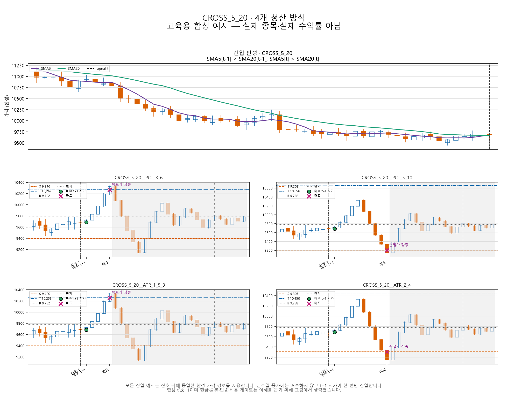

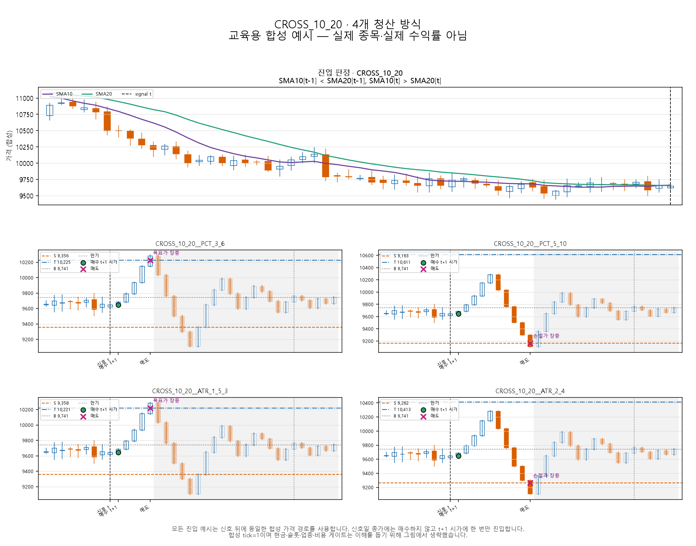

### 신고가 돌파: 20일과 60일

두 그림은 신호일 종가가 각각 직전 20일, 60일 종가 최고치를 넘는 순간과 이후 네 청산의 차이를 보여 준다.

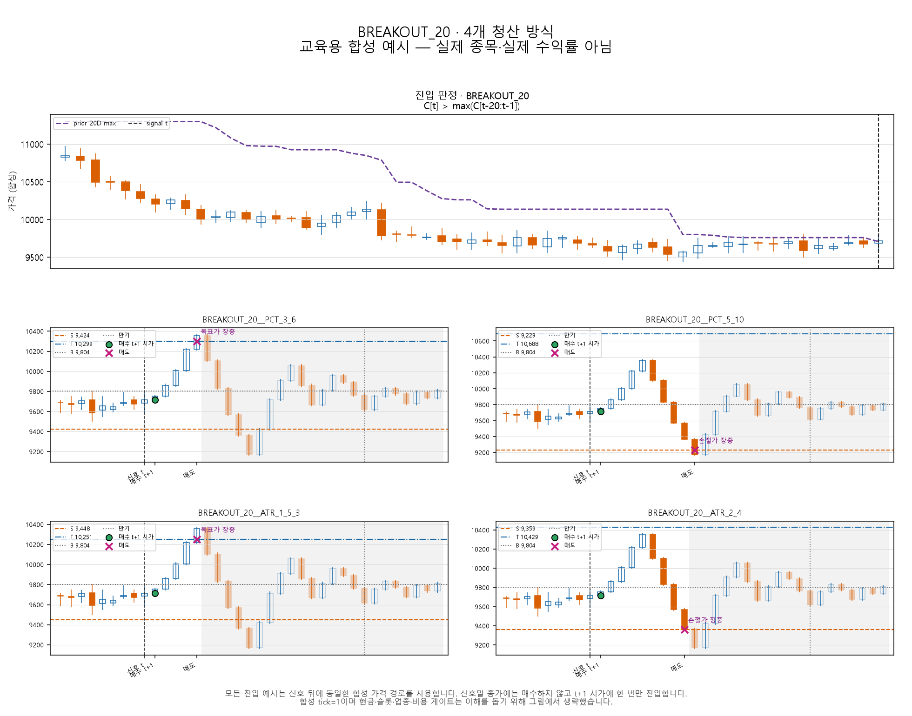

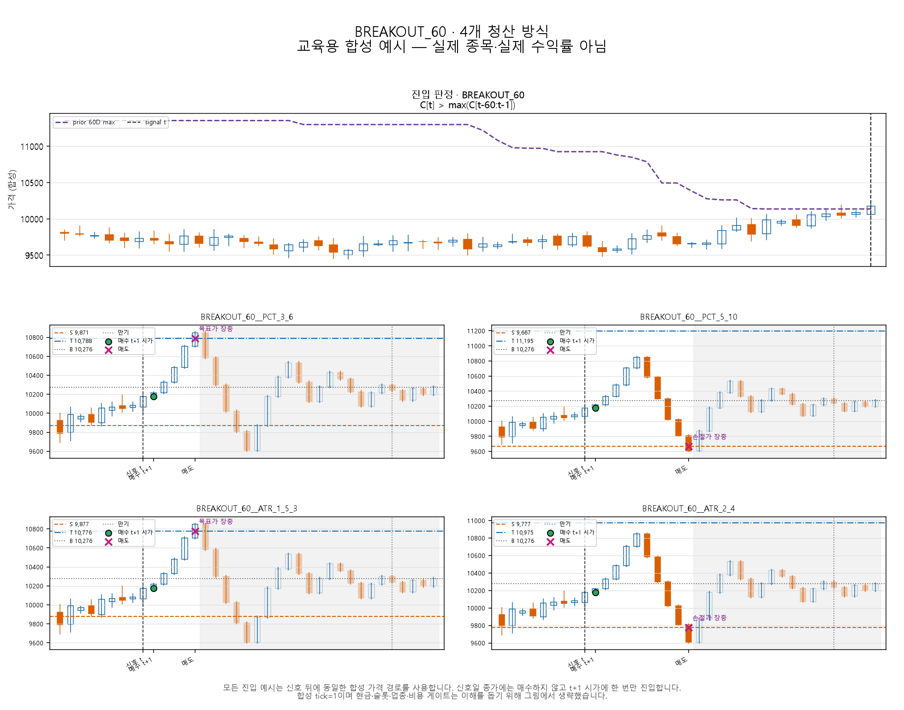

### 상승 추세 눌림목: 3일 수익률 −3%와 −5%

두 그림은 종가가 SMA60 위에 있으면서 3일 하락폭이 각각 3%, 5% 이상인 신호를 비교한다.

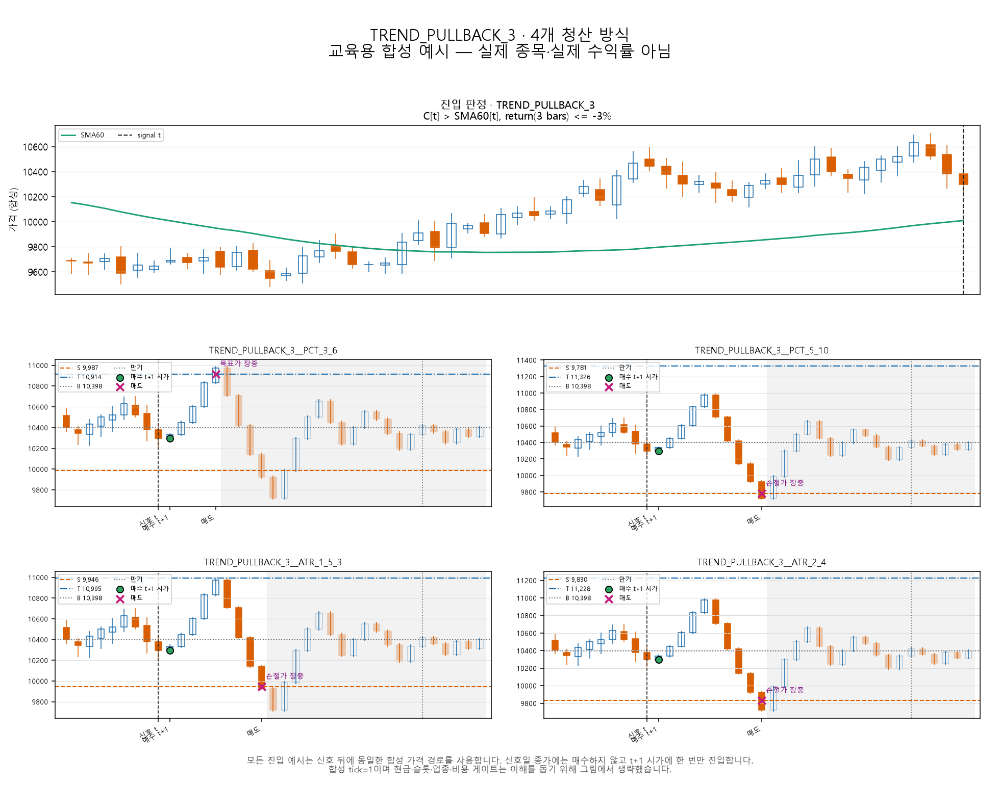

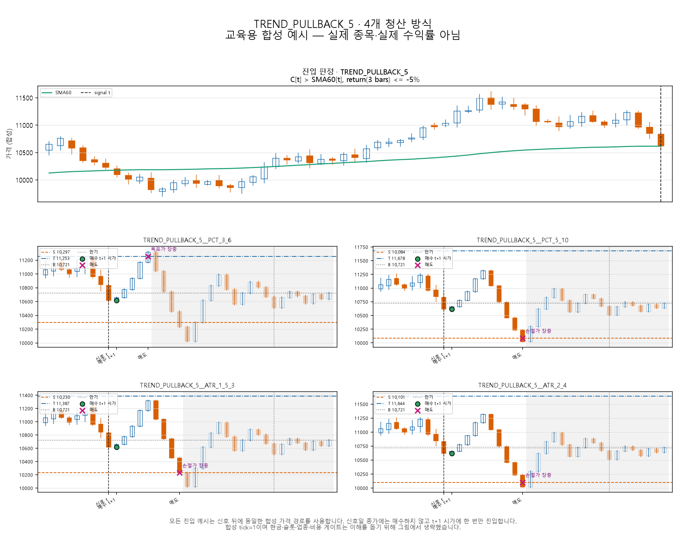

### RSI 재진입: 30선과 40선

두 그림은 SMA60 위에서 RSI14가 각각 30선, 40선 아래에 있다가 다시 기준선 이상으로 올라온 날을 신호로 삼는다.

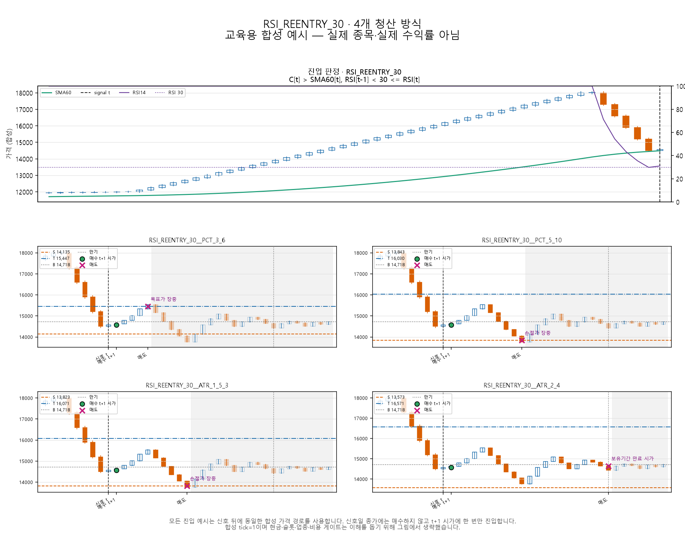

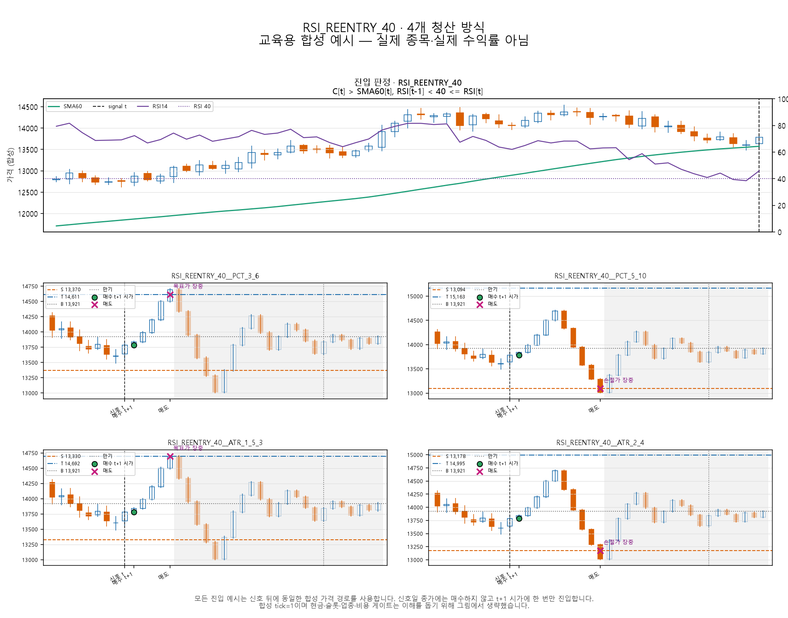

### 볼린저 하단 재진입: 1.5σ와 2σ

두 그림은 SMA60 위의 종목이 전일 볼린저 하단 아래에 있다가 당일 밴드 안으로 복귀한 경우를 보여 준다. `1.5σ`가 더 흔한 이탈, `2σ`가 더 극단적인 이탈 후보이다.

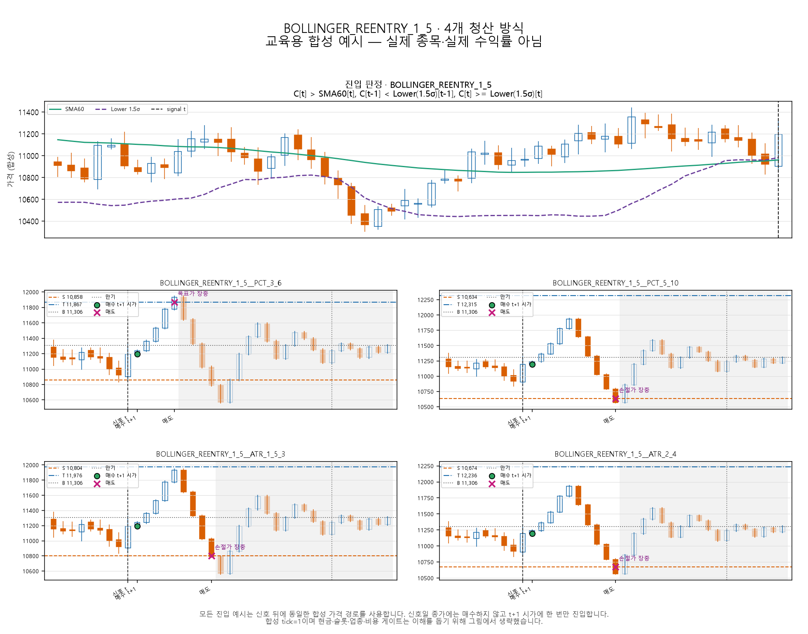

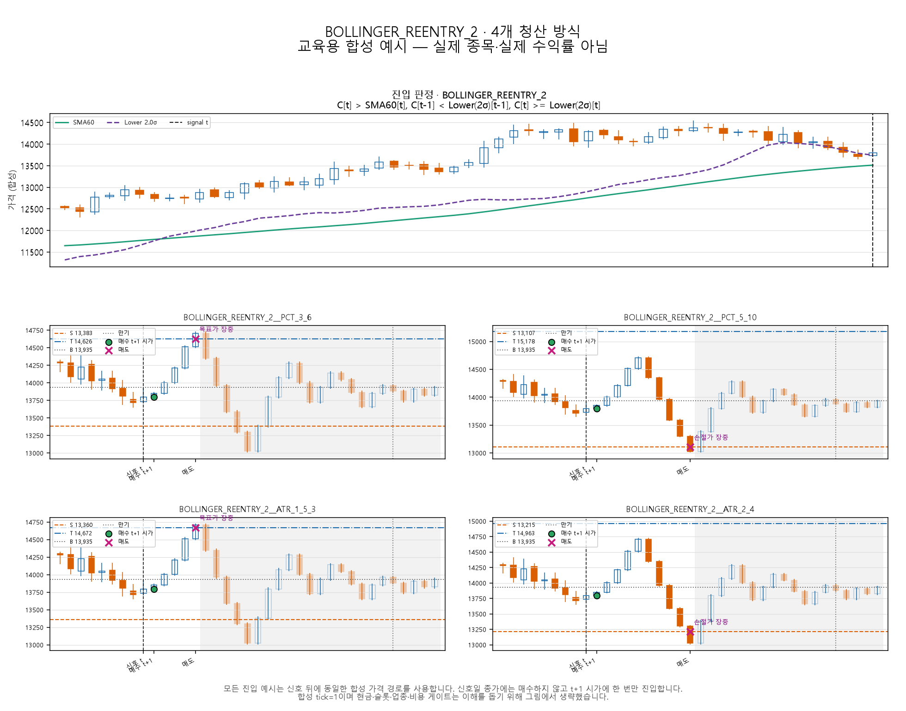

### MACD 상향 교차: SMA60과 SMA120 추세 필터

두 그림은 MACD가 신호선을 위로 통과할 때 종가가 각각 SMA60, SMA120 위에 있어야 한다는 차이를 보여 준다.

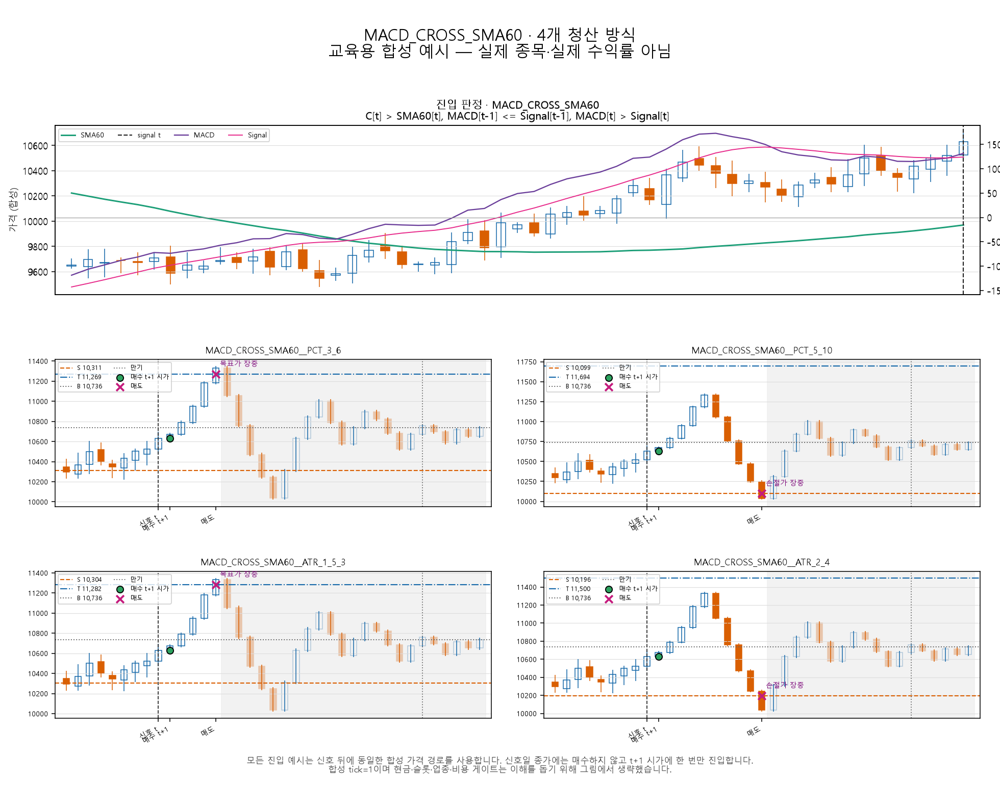

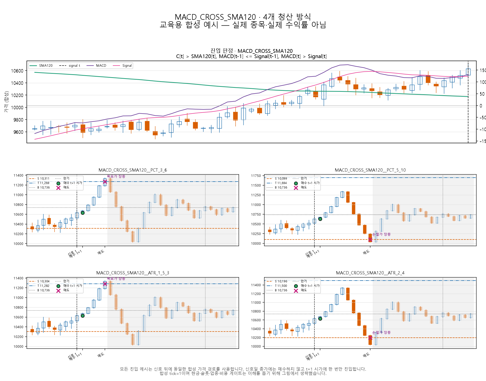

차트는 `scripts/render_krx_strategy_samples.py`로 재생성할 수 있다. 같은 디렉터리의 SVG는 확대용 원본이고 PNG는 문서 표시용이다. 생성 메타데이터에는 48개 전략 ID, B·S·T, 신호·매수·매도일, 청산 사유, 합성 입력 해시가 들어 있다.

## 7. 무엇을 측정하고 어떻게 한 후보를 고르는가

### 조합별 진단

- 신호 수, 다음 시가 진입 성공·가격상한/현금/슬롯/상태별 거절 수, 완료 거래 수와 미청산 수
- 총수익, CAGR, Sharpe, 최대낙폭, 순손익, 승률, 양/음의 총손익
- 비용, 회전율, 평균 노출·현금 비율, 최대 보유 종목 수, 보유기간과 청산 사유 분포
- 연도별 성과, 50bp 비용과 지연2 변화, 특정 종목 양의 손익 기여도, 데이터·장부 issue
- 무투자 현금과 동일 기간에 실제 매매 가능한 기준상품의 buy-and-hold 대비 성과

승률이나 총수익 하나로 결론을 내리지 않는다. 같은 진입의 네 청산과 같은 청산의 짝 진입을 함께 비교하되 신호 수, 진입 자격, 주문 수량과 체결 cohort 차이를 먼저 설명한다. 현재 명세에는 통계적 귀무가설·유의수준이 없으므로 “가설 기각” 대신 `후보 부적격`, `근거 부족`, `NO_SELECTION`을 사용한다. 거래 100건도 서로 독립인 표본 100개라는 뜻은 아니다.

### 사전 고정 적격 기준

각 후보는 2020~2023 네 해에 `(비용10·30·50bp, 지연1)`과 `(30bp, 지연2)`의 **16슬롯**이 모두 `EXECUTION_ELIGIBLE / SUCCEEDED`여야 한다. 기준 30bp·지연1에서 완료 거래 100건 이상, 양수 연도 3개 이상, 네 해 `validation_growth_score>0`, 50bp와 지연2의 growth도 각각 양수, 최악 MDD≤20%, 단일 종목 양의 손익 기여≤25%를 모두 요구한다.

통과 후보는 ① 네 해 CAGR 중앙값 내림차순 ② 최악 MDD 오름차순 ③ 연평균 회전율 오름차순 ④ strategy ID 사전순으로 정렬한다. 하나도 통과하지 못하면 `NO_SELECTION`이다. 잠금 구간 실패 시 2등으로 바꾸지 않고 새 가설·새 실험으로 시작한다.

## 8. 현재 확인된 구현 상태와 남은 한계

- `config.py`와 `strategies.py`의 12개 진입 ID 순서, 4개 청산 ID, 48개 직교 조합은 일치한다. 진입 식과 부등호도 `strategy-spec.md`와 코드가 일치한다.
- 상대거래량 두 진입과 8개 조합은 문서에 사전등록했지만 아직 코드·설정·fixture에 구현하지 않았다. 구현할 때 기본값은 v1로 유지하고 별도 schema/experiment ID에서만 후보 목록과 실행 수를 확장해야 한다.
- OBV와 거래량 위축 후 급증은 [별도 사전등록](volume-strategy-preregistration-2026-09-21.md)에 정의했으며 상대거래량 실험의 후보 수·선정·다중비교에 포함하지 않는다.
- 실제 데이터의 기본 816슬롯은 데이터 인수 실패로 차단됐고 최종 상태는 `NO_SELECTION`이다. 이는 전략 성과가 나빴다는 결과가 아니라 수익률을 계산하지 않았다는 뜻이다.
- 합성 자료에서는 개발 48건과 한 후보의 검증 16건 등 엔진 경로를 검산했지만 48개 후보의 실제 시장 성과를 검증하지 않았다.
- PostgreSQL 원본·시점 이력·기업행사·상태·비용·호가가 최신 데이터 요구사항을 통과하고 REAL runner와 독립 원장 검증이 끝난 뒤에만 기존 48개와 신규 8개의 질문에 수익률로 답할 수 있다.

## 기준 문서와 코드

- 정확한 거래 계약: [strategy-spec.md](strategy-spec.md)
- 실행·선정 계약: [technical-spec.md](technical-spec.md)
- 데이터 계약: [backtest-data-requirements-2026-09-20.md](backtest-data-requirements-2026-09-20.md)
- 구현 상태: [implementation-and-results-2026-09-13.md](implementation-and-results-2026-09-13.md)
- 후보·신호 코드: [`config.py`](../../../research/krx_lab/config.py), [`strategies.py`](../../../research/krx_lab/strategies.py)
- 거래량 후속 실험 사전등록: [volume-strategy-preregistration-2026-09-21.md](volume-strategy-preregistration-2026-09-21.md)
- 설명 차트 생성기: [`render_krx_strategy_samples.py`](../../../scripts/render_krx_strategy_samples.py)
- 차트 검증 메타데이터: [`metadata.json`](assets/strategy-samples/metadata.json)
