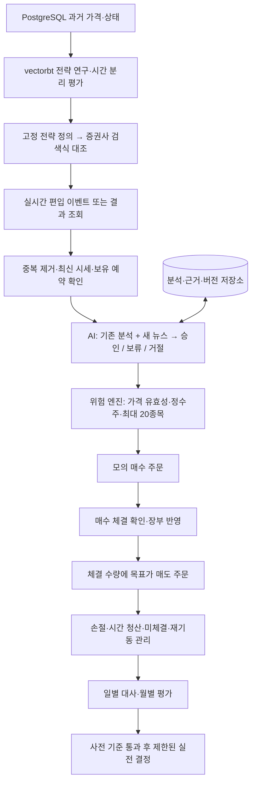

# 단기 순환매 자동매매: 목표 구조와 월 1,000만 원의 자금 조건

> **최신 요구 기준:** [Backtest Lab 설계 패키지](backtest-lab/README.md)가 우선한다. 최대 보유는 달력 1개월, 매수 전 익절·손절 가격 지정, 초기 1억 원·외부 입출금0·이익 재투자이며 별도 여유자금 1~2억 원은 제외한다. 기존 2~5일 중심 해석은 폐기했고 종목 수 확대와 매수금액 확대는 비교 후 결정한다. 현재 단계는 기술전략 일괄 연구 프로그램의 문서 설계다.

**이 문서는 사용자가 원하는 자동매매 구조와 수익 목표를 개발·검증 가능한 형태로 정리한다.** 방향은 `vectorbt 기술전략 연구 → 증권사 실시간 조건검색 → AI 뉴스 기반 매수 검토 → 위험·주문 검사 → 모의 매수 → 체결 수량에 대한 목표가 매도 → 결과 검증 후 실전`이다. 최대 보유는 약 20종목, 달력 1개월 이내의 스윙 보유와 자금 순환을 지향한다.

**현재 판단:** 방향은 구현 가능성을 검토할 수 있지만, 기존 일봉·10봉 보유 예제로 실시간 단타·목표가 청산 전략까지 검증된 것은 아니다. 사용자의 최신 정의에 따라 최대 달력 1개월 보유와 매수 전 익절·손절 가격을 지정한 48개 후보 연구로 진행한다. 당일 단타는 이번 연구의 중심이 아니다. 초기 투자금은 1억 원으로 확인됐다. 아래 투자금 역산표는 과거 목표 해석용이며 실제 투자금 제안으로 사용하지 않는다. 월 1,000만 원은 산술상 월 1%에 10억 원, 2%에 5억 원, 5%에 2억 원이지만 **해당 수익률을 달성한다는 근거는 현재 없다.**

2026-09-13 후속 요구를 반영한 설계 문서이며 자동 주문 프로그램을 구현하거나 계좌를 연결한 결과가 아니다. 아래 자본·보유기간·위험 수치는 사용자의 명시 요구와 연구 예시를 구분한다. 월별 평균 수익과 매달 일정한 출금 가능액은 다르다.

## 1. 무엇이 사용자 요구이고 무엇이 아직 제안인가

사용자가 정한 방향은 그대로 설계의 중심으로 둔다. 숫자 수익 목표를 달성하기 위해 주문 빈도·레버리지·포지션을 자동으로 늘리는 규칙은 두지 않는다.

| 구분 | 내용 | 구현·판정에 미치는 영향 |
| --- | --- | --- |
| 사용자 방향 | vectorbt로 기술적 투자기법 개발 | 백테스트 전략 정의·파라미터·버전을 먼저 고정 |
| 사용자 방향 | 키움 또는 한국투자의 검색식으로 실시간 종목 감지 | 검색식 표현 가능성과 실시간 제공 방식부터 확인 |
| 사용자 방향 | AI가 뉴스·정세·정치·전망과 기존 프롬프트를 활용해 매수 검토 | AI의 승인/보류/거절 기록과 근거를 주문 의도에 연결 |
| 사용자 방향 | 모의투자 먼저, 검증 후 실전 | 두 환경의 계좌·키·주문 주소와 결과를 분리 |
| 사용자 방향 | 매수 체결 후 예상 매도가에 매도 주문 | 주문 접수가 아니라 실제 체결 통지·조회 뒤 체결분만 처리 |
| 사용자 목표 | 최대 약 20종목, 달력 1개월 이내 스윙 순환매 | 20은 상한이며 빈자리를 채울 의무가 없음 |
| 사용자 목표 | 자동매매 월평균 1,000만 원 이상 | 비용·손실·출금 조건을 포함한 자본 시나리오 평가 |
| 사용자 방향 | 종목 AI 분석을 저장·재활용 | 가격 판단과 오래 유지되는 기업 사실을 분리 저장 |
| 최신 확정 방향 | 1억 원·최대 달력 1개월·매수 전 TP/SL·인출0 재투자 | Backtest Lab에서 일괄 비교 후 기술전략 한 개 선정 |
| 미정 | 최대낙폭, 일일 손실, 종목·업종 한도, 증권사, 세후 목표 여부 | 모의시험용 설정과 실전 허용값을 별도로 확정해야 함 |

먼저 2절에서 전체 동작을 보고, 3~4절에서 기존 백테스트와 새 전략의 차이를 읽는다. 5~6절은 투자금과 월목표의 해석, 7~8절은 분석 재활용과 운영 위험, 마지막 절은 다음 개발 순서를 설명한다. 주문 상태·프롬프트의 상세 계약은 [뉴스·모의·실전 로드맵](paper-live-news-roadmap.md), 브로커별 실제 확인 범위는 [조건검색 연동 비교](broker-condition-integration.md)에 둔다.

## 2. 전체 구조: AI 판단과 주문 실행을 연결하되 역할을 명확히

증권사 검색식은 **후보 발견 장치**, AI는 **현재 상황을 반영한 매수 검토자**, 위험 엔진은 **주문 가능 여부와 수량을 계산하는 프로그램**이다. AI 승인을 받았더라도 뉴스 유효기간 만료·급격한 가격 변화·보유 한도 초과라면 주문하지 않는다.

도식이 표시되지 않는 뷰어에서는 위에서 아래 순서로 읽으면 된다. 핵심은 **조건 편입 → AI 승인 → 위험 검사 → 매수 체결 → 목표가 매도**이며 분석 저장소는 AI 검토마다 조회·갱신한다. 실제 주문 장부는 분석 저장소와 별도로 보존한다.

예를 들어 오전에 어떤 종목이 검색식에 들어오면, 이미 보유·매수 주문 중인지 확인한다. AI는 지난 기업 분석을 불러오고 그 뒤 발생한 공시·뉴스만 검토한다. 승인이 나면 프로그램이 최신 호가와 승인 유효기간을 다시 확인해 매수를 시도한다. 100주 주문 중 40주만 체결됐다면 목표가 매도 대상은 우선 40주다. 남은 60주는 추가 체결 또는 취소가 확인될 때까지 별도 상태로 관리한다.

## 3. 기존 연구와 사용자가 원하는 전략은 어디가 다른가

**일봉 신호의 장중 사용과 목표가 매도는 새로 검증할 전략 요소다.** 기존 코드의 명령을 바꾸지 않고 아래 기능이 이미 동작한다고 설명하지 않는다.

| 항목 | 현재 제공한 연구 예제 | 이번 목표 시스템 |
| --- | --- | --- |
| 입력 | 단일종목 확정 일봉 | 일봉 + 실시간 시세 + 필요 시 분봉·체결·호가 |
| 진입 | 종가 신호 다음 관측봉 시가 | 검색 편입 시점 + AI 지연 뒤 실제 가능한 호가 |
| 청산 | 진입 뒤 10봉 시가 | 목표가 지정가 + 손절 + 최대 보유시간 |
| 계좌 | 정규화 가치 1, 분수 수량, 독립 계좌 | 원화·정수주·공동 현금·최대 20종목 |
| 뉴스 | 없음 | 당시 이용 가능한 뉴스와 캐시된 사실의 AI 판단 |
| 검증 상태 | 합성 데이터·회귀 검사 통과 | 추후 구현·모의 검증 대상 |

### 실시간 검색식으로 변환할 때 필요한 세 가지 대조

1. **표현 대조:** Python의 이동평균·돌파·거래량 조건을 HTS 검색식이 같은 창·등호·봉 기준으로 표현할 수 있는지 확인한다. 지원하지 않으면 검색식은 넓은 후보 필터로 쓰고 서버에서 정확한 기술조건을 다시 계산한다.
2. **시점 대조:** 확정 전일 일봉의 값인지 장중 변하는 현재 봉인지 구분한다. 당일 최종 거래량·최고가·종가를 오전 의사결정에 쓰면 미래정보가 들어간다.
3. **실행 대조:** 이벤트 수신 → 뉴스 처리 → AI 응답 → 주문 전송 사이의 지연과 그동안의 가격 변화를 기록한다. 백테스트에서 신호 즉시 체결로 계산하지 않는다.

키움과 한국투자가 동일한 조건식을 직접 가져올 수 있다고 가정하지 않는다. 조회 API가 있다고 실시간 편입·이탈 푸시까지 제공한다고 보지 않는다. 모의환경에서 검색식이 지원되지 않을 경우 실시간 관측과 모의 주문을 분리하는 방법 및 그 한계를 [브로커 비교](broker-condition-integration.md)에 정리한다.

### 짧은 보유를 위한 연구 순서

| 단계 | 후보 | 필요한 입력과 판정 |
| --- | --- | --- |
| 기준선 | 기존 6개 후보·10봉 청산 | 원래 결과를 보존해 변경 효과를 비교 |
| 스윙 1차 | 12개 진입 × 4개 TP/SL + 달력 1개월 기한 | 새 전략 명세의 갭·동봉 충돌·정수주·공동계좌 적용 |
| 스윙 2차 | 같은 진입 + 변동성/저항선 기반 목표가·손절 | 장중 선후를 알 수 있는 분봉·체결 자료 필요 |
| 단타 | 장중 검색 편입 + 짧은 지연 + 당일 시간 청산 | 분봉·실시간 이벤트·호가·거래량 참여율·미체결 모형 |

위 보유기간은 연구 제안이다. 여러 진입·목표·손절·보유기간을 한꺼번에 조합해 가장 좋은 값만 고르지 않는다. 일봉에서 고가가 목표가를 넘었다는 사실만으로 내 주문이 먼저 체결됐다고 단정할 수 없고, 같은 봉에서 목표가·손절가가 모두 닿으면 선후가 미확정이다. 자료가 없으면 불리한 순서 스트레스 결과를 따로 남기며 체결 검증 완료로 부르지 않는다.

## 4. 목표가 매도를 걸어둔 뒤에도 관리가 필요하다

예상 매도가는 **단기 거래 목표가**다. 장기 기업가치 평가의 목표주가를 그대로 며칠짜리 주문가격으로 사용하지 않는다. 기술전략이 목표 범위·손절·최대 보유시간을 제시하고 AI는 촉매·악재·근거 변화와 그 범위의 적절성을 검토한다. AI가 조정한 목표 범위도 별도 전략 버전으로 평가하고 프로그램이 현재 가격·호가단위·위험 대비 보상을 검사한다.

| 발생 상황 | 필요한 처리 |
| --- | --- |
| 매수 일부 체결 | 누적 체결 수량과 이미 매도로 예약한 수량의 차이만 추가 매도 대상으로 계산 |
| 목표가 매도 미체결 | 주문 유효시간·당일 만료·익일 재등록 규칙에 따라 실제 주문 상태를 조회 |
| 목표가 매도 중 손절 발생 | 기존 매도 잔량의 취소·체결 경합을 확인하고 남은 실제 보유량만 보호 청산 |
| 보유기한 만료 | 손실 중이라는 이유로 단기 전략을 장기 보유로 바꾸지 않고 사전 시간 청산 규칙 적용 |
| 장 마감·정지·VI·가격제한 | 주문 접수·정정취소·체결 가능 여부를 확인하고 미체결 위험 기록 |
| 서버 재시작 | 브로커 주문·체결·잔고와 장부를 대조한 뒤 새 주문 허용 |

목표가 주문과 손절 주문을 동시에 낼 때 하나가 체결되면 다른 하나가 자동 취소되는 OCO 기능은 브로커·계좌의 지원을 확인해야 한다. 지원하지 않으면 프로그램이 두 청산의 수량·취소·경합을 관리한다. 목표가 지정가 주문을 제출하는 것과 다음 날의 예약주문 기능은 다르다. 단순히 “매도를 걸어두었으니 서버를 꺼도 된다”고 판단하지 않는다.

## 5. 월평균 1,000만 원에는 얼마의 투자금이 필요한가

**필요 투자금은 검증된 계좌 수익률이 있어야 정할 수 있다.** 아래는 기대수익 예측이 아니라 목표를 수익률별로 역산한 계산표다. 수익률은 개별 거래나 투자한 종목만의 수익률이 아니라 **현금 비중을 포함한 전체 운용 계좌의 월수익률**이어야 한다.

기본 계산은 `투자금 C = 목표 월이익 P / 비용 차감 월수익률 r`이다. 아래 표는 매매 수수료·거래 관련 세금·슬리피지를 차감한 r, 별도 고정 운영비 0, 개인별 소득·양도 과세를 별도 확인한다는 조건이다. 실제 목표가 세후 생활비라면 그 조건으로 다시 계산해야 한다.

| 가정한 계좌 월수익률 | 월 1,000만 원의 산술 투자금 | 12개월 같은 비율로 재투자 시 연복리 환산 | 이 투자금에서 -20% 낙폭의 손실액 |
| --- | ---: | ---: | ---: |
| 0.5% | 20억 원 | 약 6.17% | 4억 원 |
| 1% | 10억 원 | 약 12.68% | 2억 원 |
| 2% | 5억 원 | 약 26.82% | 1억 원 |
| 3% | 약 3억 3,333만 원 | 약 42.58% | 약 6,667만 원 |
| 5% | 2억 원 | 약 79.59% | 4,000만 원 |
| 10% | 1억 원 | 약 213.84% | 2,000만 원 |

연복리 열은 수익률 수준을 이해하기 위한 `(1+r)^12-1`이며 매월 이익을 출금하는 경우의 자산 증가율이 아니다. 실제 월수익률은 변동하므로 산술 평균 월수익률을 이 식에 넣은 값이 실현 연수익률과 같지도 않다. 월 5~10%를 필요한 자본을 줄이기 위한 기본 가정으로 채택하지 않는다. r이 0 이하이면 이 식으로 목표를 달성하는 유한한 자본을 구할 수 없다.

### 운영비·현금 비중을 넣으면 요구 자본이 달라진다

월 고정 운영비 K가 별도라면 `C = (P + K) / r`이다. **예시**로 AI·뉴스·서버 비용을 합쳐 월 30만 원, 계좌 월수익률 2%라고 가정하면 `1,030만 / 0.02 = 5억 1,500만 원`이다. 30만 원은 실제 견적이 아니며 호출량과 공급자 계약이 정해진 뒤 계산한다.

만약 “2%”가 계좌 전체가 아니라 실제 투자된 금액만의 수익률이고 평균 투입 비중 u가 80%라면 `C ≈ (P + K) / (u × r_invested)`로 **약 6억 4,375만 원**이다. 이 식은 단순한 고정 노출 가정이며 실제로는 현금·포지션 일별 원장으로 산출한다. 계좌 전체 r에 이미 현금 비중이 포함됐다면 u를 다시 곱하지 않는다.

큰 자금을 넣으면 수익률이 그대로 유지된다는 보장도 없다. 종목의 호가 잔량·참여율·체결 충격·미체결 비중에 따른 **수용 가능 자금 규모**를 따로 측정한다. 계산상 필요한 금액보다 전략이 감당할 수 있는 금액이 작으면 자본만 늘려서는 목표를 달성할 수 없다.

### 평균 수익과 생활비 출금은 분리

손실월이 있는 전략에서 매월 1,000만 원을 출금하면 원금과 다음 달 포지션 규모가 줄어든다. **최신 조건은 인출0이며 이 단락의 월 출금은 가정 비교일 뿐 실제 운용 요구가 아니다.** 여유자금 1~2억 원은 거래 계좌에 자동 편입하지 않는다. 계획을 정할 때 월평균뿐 아니라 월 중앙값, 최악의 달, 적자월 비중, 낙폭·회복기간, 목표 미달 월 비중, 출금 후 잔고를 확인한다. 입출금이 있으면 시간가중 수익률과 원화 손익을 나눠 보고한다.

실전 자본을 정할 순서는 `비용 반영 표본 외 성과 → 뉴스 결합 모의 성과 → 보수적 수익률 구간 → 유동성 한도 → 감내 가능한 손실액 → 출금 계획`이다. 예를 들어 최대 감내 손실액이 L이고 스트레스 낙폭을 d로 정했다면 위험 측면 자본 상한은 단순화해 `L/d`로 볼 수 있다. 수익 목표상 필요한 자본이 이 상한을 넘으면 목표·전략·기간을 재검토해야 한다. d를 넘는 손실이 발생할 가능성은 별도로 남는다.

## 6. 자주 거래하면 목표에 가까워지는가

**빈도가 아니라 거래당 비용 차감 기대값과 계좌 전체의 실행 결과가 중요하다.** 수익이 부족하다고 당일 매매 횟수를 늘리는 규칙은 두지 않는다. 단기 거래의 비용·급격한 손실 위험은 [Investor.gov 단기거래 설명](https://www.investor.gov/introduction-investing/investing-basics/glossary/day-trading)과 [FINRA 거래빈도·비용 설명](https://www.finra.org/sites/default/files/NoticeDocument/p011783.pdf)에서도 확인된다. 이 자료의 미국 계좌 규정을 한국 계좌에 적용하는 것은 아니다.

거래당 단순 기대값은 `승률 × 평균 이익률 − 패배율 × 평균 손실률 − 왕복 비용률`이다. **예시** 승률 45%, 이익 거래 평균 +3%, 손실 거래 평균 -2%, 왕복 총비용 0.3%라면 `0.45×3% − 0.55×2% − 0.3% = -0.05%`다. 비용 전에는 +0.25%였지만 비용 후에는 손실 기대값이 된다. 이 예시는 측정된 전략 수치가 아니다.

`종목당 목표수익 × 20종목 × 월 회전수`만으로 월이익을 계산하면 손절·미체결·현금·겹치는 포지션·손실의 상관성을 놓친다. 실제 월이익은 공동 계좌의 체결과 평가 장부에서 계산한다. 20종목이 같은 정치 테마나 반도체 업종에 몰리면 분산이 충분하지 않을 수 있으므로 종목 수 외에 업종·테마·시장 방향 노출을 제한한다.

최대 20개를 계산할 때는 보유 종목과 미체결 매수로 자리를 예약한 종목의 **합집합**을 센다. 동시에 19개를 보고 두 프로세스가 각각 한 종목을 추가해 21개가 되지 않도록 원자적으로 자리를 예약한다. 기존 종목 추가 매수는 종목 수가 같더라도 위험금액·총 비중 한도 검사를 다시 한다. 기본 연구안은 물타기 없이 시작한다.

예를 들어 **설명용으로만** 5억 원의 80%를 20종목에 동일 배분하면 종목당 2,000만 원이다. 20개가 모두 채워져야 한다는 뜻이 아니며, 실제 수량은 정수주·매수가능금액·손절까지의 위험금액·유동성 중 가장 작은 한도로 산정한다. 매도 후 재사용 가능한 자금은 추정 현금이 아닌 브로커의 현재 매수가능금액으로 확인한다.

## 7. 분석 재활용: 과거 결론을 반복하는 대신 새 사실만 갱신

기존 프롬프트 4개는 배경 분석의 재료로 사용하고, 신호마다 전문 전체를 반복하지 않는다. 기업의 사업 구조는 오래 쓸 수 있지만 “지금 매수해도 되는가”는 현재 호가·새 공시·검색식 상태가 바뀌면 다시 판단해야 한다.

| 저장 종류 | 재사용할 내용 | 다시 계산하는 계기 |
| --- | --- | --- |
| 시장 브리핑 | 국제정세·정책·환율·시장 위험과 출처 | 새 거래일, 긴급 사건·공식 정정 |
| 산업 분석 | 산업 구조, 수혜·피해 연결의 근거 | 정책·업황·주요 공시 변화 |
| 종목 프로필 | 사업·재무·거래 제약·과거 검토의 사실 | 실적·증자·합병·관리/정지·코드 변경 |
| 뉴스 사건 | 원문 ID·해시·발행/수집/이용 가능 시각·정정 | 새 기사·정정·동일 사건 추가 근거 |
| AI 매수 검토 | 승인/보류/거절·근거 ID·유효기간·당시 가격 범위 | 새 신호, 유효기간 만료, 가격 이탈, 새 중요 뉴스 |
| 운용 결과 | 검토→주문→체결→최종 손익 연결 | 체결·취소·청산 이벤트마다 추가 |

저장은 기존 PostgreSQL에 별도 스키마를 두거나 별도 분석 DB로 구성할 수 있다. 원본 가격 테이블을 분석 결과로 덮어쓰지 않는다. `analysis_id`, `stock_id`, `strategy_version`, `prompt_version`, `model_version`, `as_of`, `valid_until`, `source_ids`, `parent_analysis_id`, `invalidation_reason`으로 버전을 연결한다. 뉴스 전문은 이용 권한에 따라 보존하고, 허용되지 않으면 링크·메타데이터·허용된 요약만 저장한다.

거절된 판단도 저장하면 같은 종목이 반복 편입될 때 중복 분석을 줄일 수 있다. 다만 거절 이유가 해소된 새 공시가 나오면 캐시를 무효화한다. 승인 캐시가 있어도 현재 시세·계좌·검색 편입 상태 검사는 생략하지 않는다. 과거 AI 보고서의 추정이 새 분석에서 확인된 사실로 둔갑하지 않도록 사실·추론·미확정을 별도 필드로 둔다.

[뉴스·모의·실전 로드맵](paper-live-news-roadmap.md)에 원본 프롬프트별 역할, 최적화된 매수 검토 프롬프트와 출력 형식을 제공한다. 가상 전문가들의 긴 토론은 독립된 예측 검증으로 세지 않는다. 실제 팀 호출·모델 수는 필요성과 지연·비용에 따라 결정한다.

## 8. 추가로 챙겨야 할 설계 문제

사용자의 흐름을 실제 운영하려면 주문 실패뿐 아니라 기회의 소멸과 분석의 오류도 다뤄야 한다.

| 놓치기 쉬운 상황 | 추가할 기준 |
| --- | --- |
| AI 응답 전에 급등 | 신호·AI 응답·호가의 유효기간과 최대 지연 설정, 오래된 승인은 재검토/취소 |
| 장중 편입·이탈 반복 | 이벤트 ID·종목·전략별 중복 제거와 재검토 간격, 이탈 시 미체결 취소 정책 |
| 뉴스 없음 또는 반대 뉴스 | 없음·미수집·상충을 구분, 임의 긍정 점수 대신 보류 사유 기록 |
| 정치 테마의 약한 연결 | 인맥·소문과 실제 매출/정책 수혜 근거를 분리, 모델의 연상만으로 연결하지 않음 |
| 기업가치는 긍정적이지만 단기 진입은 비쌈 | 장기 목표주가와 단기 거래 목표가·위험 대비 보상을 분리 |
| 목표가 주문을 걸었는데 손절 수량이 부족 | 예약 매도 수량·부분체결·취소 응답을 원장과 대조 |
| 정전·인터넷·DB 장애 | 신규 주문 정지, 브로커 잔고 조회·기존 주문 확인·수동 비상 절차 |
| 홈서버가 장중 꺼짐 | 목표가 주문만으로 보호가 끝나지 않음; 필요한 매매 시간 동안 주문 감시 가용성 확보 |
| KRX 데이터와 다른 거래시장 시세 혼용 | 시장·세션·호가·주문 경로를 고정, NXT 등 확장은 별도 평가 |
| 좋은 월만 골라 보고 | 사전 월별 보고 형식과 전체 거래·거절·손실월 보존 |
| 분석 비용이 수익을 잠식 | 후보 중복 제거·공통 브리핑·차분 분석, 월 토큰/뉴스/서버 비용을 성과에 차감 |

위험 한도·운영 중단은 월 1,000만 원 달성 여부보다 우선한다. 손실을 만회하려고 투자금·주문 횟수·허용 갭을 자동 확대하지 않는다.

## 9. 다음 작업: 문서에서 모의투자 프로그램으로

1. **가격 데이터 인수:** 현재 DB 접속은 정상이다. 0원·0거래량 봉과 기업행사·가격 조정·역사 유니버스를 분리 검증한다. [실행 안내](backtesting-to-live-guide.md)의 최신 관측과 명령을 따른다.
2. **짧은 보유 전략 연구:** 기존 6개 기준선을 유지하고 최대 달력 1개월과 매수 전 익절·손절을 포함한 48개 후보를 비교한다. 현재 실행 예제에는 새 전략을 구현하지 않았다.
3. **검색식 대조:** 두 증권사 중 필요한 조건과 모의 제약을 충족하는 경로를 정하고 동일 시점 검색 결과와 Python 조건을 대조한다.
4. **무주문 관찰·분석 저장:** 실시간 편입, AI 검토, 지연, 캐시 재사용·무효화부터 기록한다.
5. **뉴스 결합 모의:** 사용자가 원하는 AI 검토를 포함한 B를 모의운용하고 기술 단독 A를 비교 장부로 함께 관찰한다. 계좌 자원을 분리할 수 없으면 A를 가상 비교로 표시하고 체결조건 차이를 보고한다.
6. **운영·성과 판정:** 부분체결, 목표가 매도, 손절 경합, 재기동, 20종목 상한을 장애 시험한다. 관찰기간 예시 3개월·완료 거래 100건은 개발 검토의 출발점일 뿐 통계적 입증이나 자동 실전 허가가 아니다. 서로 다른 국면과 거래 집중도를 함께 보고 실제 기준은 시작 전에 확정한다.
7. **실전 자금 결정:** 비용 후 계좌 성과의 보수적 구간·낙폭·자금 수용 한도를 이용해 월목표 가능성과 손실금액을 다시 계산한다. 작은 실전에서 체결 차이를 확인한 뒤 확대 여부를 결정한다.

## 근거와 계산 재현

- 사용자 요구: 2026-09-13 후속 메시지의 최대 약 20종목·단타/스윙·AI 검토·목표가 매도·월평균 1,000만 원·분석 재사용.
- 직접 계산: [투자금 시나리오 JSON](evidence/capital-scenarios-2026-09-13.json). 외부 전략 수익률을 가져온 표가 아니며, 재현식은 `C=P/r`, `C=(P+K)/r`, `(1+r)^12-1`이다.
- DB 현재 집계: [읽기 전용 결과](evidence/db-current-status-2026-09-13.json), [가격 0원 진단](evidence/db-reconnected-2026-09-13.txt).
- 프롬프트 원본: [모닝브리핑](prompt/모닝브리핑_프롬프트.txt), [개별종목](prompt/부코드_개별종목분석용.txt), [산업](prompt/부코드_산업분석용.txt), [통찰력](prompt/부코드_통찰력투자사고.txt). 원본 파일은 수정하지 않았다.
- 매매 비용·위험의 일반 원칙: 앞서 연결한 Investor.gov·FINRA 공식 자료. 한국 시장의 실제 비용·주문 제약은 선택한 증권사·계좌·해당 거래일 규칙을 별도로 적용한다.
